It’s been a few months after a memorable trip to the financial capital of the UAE and I sit here recalling a trip that contained two of the best things I’ve experienced. I’ve summarized the trip, experiences, and a brief of the expenses incurred. 

## Plan

I’ve wanted to travel to Dubai ever since a few of my friends travelled there when I was doing my 1st-year B.E. Sometime in May 2024, I realized that if I applied 3 days of leave during the last week of October, I would end up with 9 days of holidays and the same being the shoulder weeks of peak season in Dubai meant it was time the trip happened. I ended up booking return flight tickets on Emirates Airlines, a Boeing 777 for the onward journey on the 26th of October and the return on the 1st of November on an Airbus A380; An aircraft I wanted to travel in and an Airline my mother wanted to experience.

## Itinerary and Logistics
Although my parents and I had an organised tour to Malaysia and Singapore in December 2017, this was my first experience planning a trip outside of India, which made me a bit nervous. My flights were scheduled to arrive in Dubai at half past noon on the 26th and depart at 9:30 PM on the 1st. I had made my reservations through Emirates. I had seven whole days to tour the United Arab Emirates as a result.

After reading a ton of blogs and watching vlogs, I concluded that since my parents would be travelling with me and the trip would require a lot of walking, it would be best if I had a single home base for the duration of the trip. Localities in Dubai according to me can be mainly divided into three regions.

1.	Deira: Old Dubai where a lot of people from the subcontinent live and the stays are usually more cost-effective. An added advantage of this is there are many Indian restaurants available.
2.	Central Dubai: Almost all the tourist attractions are nearby from this area and is very well connected by the Metro.
3.	Jumeirah: This is where you get the most luxurious stays and probably the part of Dubai with the most Western influence.

If high-rise structures and rooms with a view appeal to you, then options 2 and 3 would be the best location to stay in. Since I had decided I wouldn’t rent a car, I booked the Canal Central Hotel in Business Bay which was around 2km from the Business Bay Metro stop in central Dubai and paid a premium for a room with a view of the Burj Khalifa. The booking was done through booking.com.

With the travel and the home base booked, it was time to plan my itinerary which mainly revolved around my Formula Yas 3000 driving experience and skydiving at the Palm. Below is the Itinerary I came up with for the 7 days.

|     Day    |     Time        |     Place                                                                                 |     Booking through          |
|------------|-----------------|-------------------------------------------------------------------------------------------|------------------------------|
|     1      |     5:00 PM     |     [The palm (Private beach of the hotel)](https://maps.app.goo.gl/B3NGfk2ensriFXDC9)    |     Part of hotel booking    |
|     1      |     6:15 PM     |     [The Lost Chambers Aquarium](https://maps.app.goo.gl/fDBGDxdCUwebbsGG7)               |     Klook                    |
|     1      |     7:30 PM     |     [View at the palm](https://maps.app.goo.gl/kww3mxrrCm7xvM178)                         |     Klook                    |
|     2      |     10:30 AM    |     [Sky Views Observatory](https://maps.app.goo.gl/TvaVnTLJ3fKB5UEz8)                    |     Klook                    |
|     2      |     12:30 PM    |     [Dubai Aquarium and Underwater Zoo](https://maps.app.goo.gl/pHCmKGDw4vdMbJHk6)        |     Klook                    |
|     2      |     3:00 PM     |     [Arte Museum](https://maps.app.goo.gl/pLS6oWSzzga1Aiqf9)                              |     Klook                    |
|     2      |     4:30 PM     |     [Burj Khalifa](https://maps.app.goo.gl/LJTUYT2hJpqCcJBNA)                             |     Website                  |
|     2      |     7:45 PM     |     [Burj Khalifa fountain boat ride](https://maps.app.goo.gl/7TTdjRux6uvthQKo9)          |     Klook                    |
|     3      |     10:30 PM    |     [Museum of the Future](https://maps.app.goo.gl/YHwwvdmt1LJx8YSA8)                     |     Website                  |
|     3      |     2:30 PM     |     [Dubai Frame](https://maps.app.goo.gl/7vL8CSD3zsmvEdPJ7)                              |     Klook                    |
|     3      |     5:00 PM     |     [Dubai Dolphinarium](https://maps.app.goo.gl/fvHgPGNhEzengjqr6)                       |     Website                  |
|     4      |     10:30 AM    |     [Formula Yas 3000, Yas Island Abu Dhabi](https://maps.app.goo.gl/QDqMfQdsep9unxRt8)   |     Website                  |
|     4      |     1:30 PM     |     [Ferrari World, Yas Island Abu Dhabi](https://maps.app.goo.gl/Ffh4phUSwA87bCDb9)      |     Go City                  |
|     5      |     10:30 AM    |     [Skydive Dubai, at the palm](https://maps.app.goo.gl/wqzWM2yCmMUQ2JKC7)               |     Website                  |
|     5      |     2:30 PM     |     [Speed boat tour](https://maps.app.goo.gl/kSBHxYFxBcjTHbdG8)                          |     Klook                    |
|     5      |     4:00 PM     |     [Dubai Marina Mall](https://maps.app.goo.gl/EhXwNQFaSVGxyN6X8)                        |     N/A                      |
|     5      |     8:30 PM     |     [Dubai Dhow Cruise](https://maps.app.goo.gl/X7ZEH6AGqb22FVvJ9)                        |     Go City                  |
|     6      |     11:00 AM    |     [Dubai Miracle Garden](https://maps.app.goo.gl/veXyScPZkgFK1EzbA)                     |     Klook                    |
|     6      |     3:00 PM     |     Dubai Desert Safari                                                                   |     Go City                  |
|     7      |     11:30 PM    |     [Dubai Ice Rink](https://maps.app.goo.gl/rYv3hKxqXmEBVemw5)                           |     Website                  |
|     7      |     2:00 PM     |     Dubai city tour                                                                       |     Hotel Taxi               |

After deciding on the itinerary, it was time to figure out how to get to these places and after doing a lot of research with the help of Google Maps, and Dubai RTA, I decided that the Metro, City Buses, and Taxi through Uber and Careem would suit the three of us the best along with the occasional walk.
	
The pending things now were the 60-day UAE tourist Visa which could be applied up to 30 days in advance, forex cards, and travel insurance. Getting the Visas was pretty easy through my Emirates booking and our Visas were processed within 48 hours. Indian Nationals were also given the option of Visa on arrival nearer to our travel dates. Regarding forex cards, I used OneCard, a credit card that charged 1% as forex fees and would be reimbursed as credit card points. For the features it provided, I also applied for the ICICI Sapphiro Forex card and the Global Niyo Forex card, which had the lowest Forex conversion rate (just Visa costs). They both had no forex charges. Finally, after going through a bunch of options, I narrowed in on ICICI Lombard travel insurance.

## Food and Expenses
Being vegetarian has its set of advantages but comes with the biggest disadvantage of finding food when outside India. To tackle this, we packed 7 to 8 packets of ready-to-eat meals with a small electric cooker and a few boxes as a backup in case we didn’t find anything suitable to eat in our hotel and packing it did pay its dividends. Canal Central did offer us complimentary breakfast which had a few vegetarian options. I’ve listed the places where we ate for breakfast/lunch/dinner below.

|     Day     |     Breakfast/Lunch/Dinner                                                |
|-------------|---------------------------------------------------------------------------|
|     1       |     BLR Airport/Canal   Central/ Ready to Eat                             |
|     2       |     Canal Central/   Bikanerwala(Dubai mall)/ Bikanerwala(Dubai mall)     |
|     3       |     Canal Central/ MTR/   Ready to Eat                                    |
|     4       |     Ready to Eat/ Rasoi   Ghar(Ferrari World)/ Kamat Veg(Business bay)    |
|     5       |     Canal Central/   Saaranga Bhojan Shala(Dubai Marina)/ Dhow Cruise     |
|     6       |     Canal Central/ Ready   to Eat/ Desert Safari Dinner                   |
|     7       |     Canal Central/   Bikanerwala(Dubai mall)/ DXB Airport                 |

Finally coming to the expenses, I must say I did go a bit overboard with a few premium entrances, quick passes, skydiving, and the driving/passenger experiences. But there’s a very remote possibility of my parents visiting Dubai again. The currency was around 22.7 INR for 1 AED and I got a mix of 22.91 INR and 23.75 INR for 1 AED in my forex cards. Also, unless per Person is mentioned, the expenses are for 3 people.

|     Item                                    |     Cost        |     Description                                                                                  |
|---------------------------------------------|-----------------|--------------------------------------------------------------------------------------------------|
|     Flights+Stay+Visa+Travel   Insurance    |     INR 2.5L    |                                                                                                  |
|     Local Travel                            |     1718AED     |     Bus+Metro+Taxi                                                                               |
|     Local Food                              |     1041AED     |     Hotel Food only   other than breakfast                                                       |
|     Klook+Go City                           |     INR 1.2L    |     8 regular + 1   premium attraction pass through Klook     3 activities through   go city     |
|     Skydiving at the   palm                 |     2749AED     |     Includes diving   video + selfie (Per person)                                                |
|     Formula Yas 3000                        |     2050AED     |     15 min drive + Video   (Per person)                                                          |
|     Burj Khalifa                            |     1659AED     |     Floors 148+125+124   and refreshments                                                        |
|     Museum of the Future                    |     1197AED     |     Priority pass   entrance                                                                     |
|     Ferrari world Quick   pass              |     149AED      |     (Per person)                                                                                 |
|     Ferrari Passenger   experience          |     1250AED     |     20 min passenger   drive in a Ferrari Portofino                                              |
|     Dubai Ice Rink                          |     105AED      |     (Per person)                                                                                 |
|     Dubai City tour                         |     600AED      |                                                                                                  |
|     Dubai Dolphinarium                      |     309AED      |     Includes Creek   Entrance                                                                    |

## Experiences
# Day 1
The experience of Dubai started immediately after boarding the plane as the economy seat in the Emirates Boeing 777 already was more luxurious than any other flight that I’d been on. The legroom was huge, the meals were good and the in-flight entertainment did not allow me to get any sleep over the next three and a half hours. Each individual got a free sim with a data pack when we passed through immigration valid for a day from activation. After getting the metro to Business Bay, I booked an Uber to the hotel and a Tesla Model X showed up!

Canal Central had a resort at the Palm Jumeirah with a private beach that we could access. The sunset that I saw here was probably the best that I saw in Dubai. Below is a photo of the same where you can see the matchbox structure of the Royal Atlantis at the right.

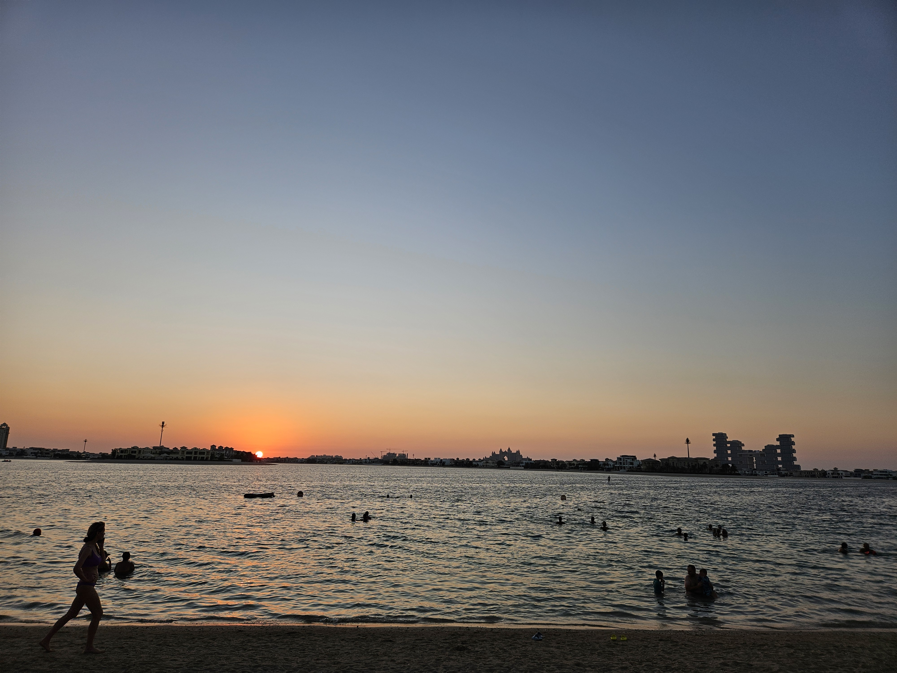

Next up, was the Lost Chambers Aquarium which I liked for the design, but I wouldn’t say is a must-visit. Since the Lost Chambers was completed pretty quickly, I could find time to visit the View at the Palm at Zabeel Mall and the view here of Dubai marina and the palm is mind-boggling. I can’t forget the experience here that was complimented by the cool breeze.

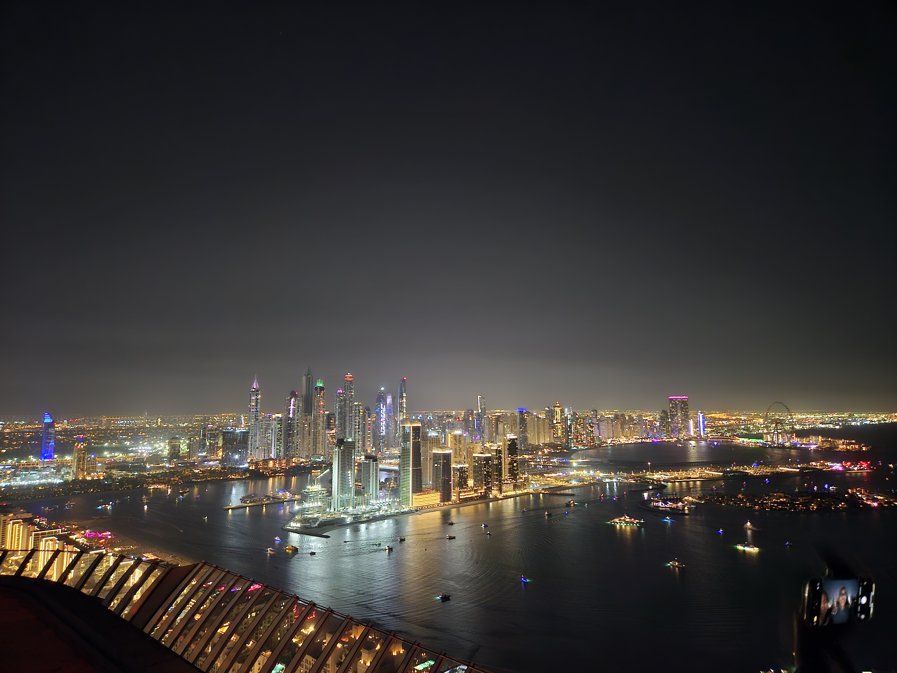

# Day 2

This day started with us going to the Sky Views observatory which offers some breathtaking views of the Burj Khalifa and Central Dubai. This also has a glass slide on the 52nd floor as well as a skywalk option which is a fun activity.

Post this we proceeded by foot to Dubai Mall where we’d spend the rest of our day, and contrary to what I had read online, I found walking around in Dubai to be quite easy. (Maybe because I handle the streets of India). Entering the mall was an experience on its own. There were all kinds of exotic cars parked at the entrance with their engines running and all sorts of luxury shops with brand names that I had never heard of previously. The first stop was the Dubai Aquarium which by itself is huge and accommodates all kinds (Not that I know of many) of marine life. Penguins are a cool addition to this place. 

Next up Arte Museum. This place is again a must-visit in Dubai and is like something that I had never seen or imagined before. The kind of artistic effects created with the help of Audio and Visual is definitely out of the world. The museum itself is home to multiple themes.

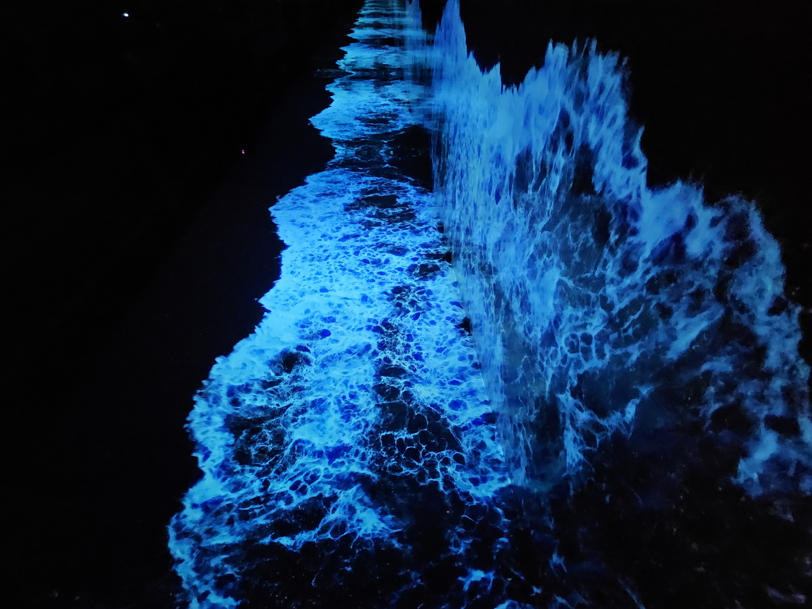

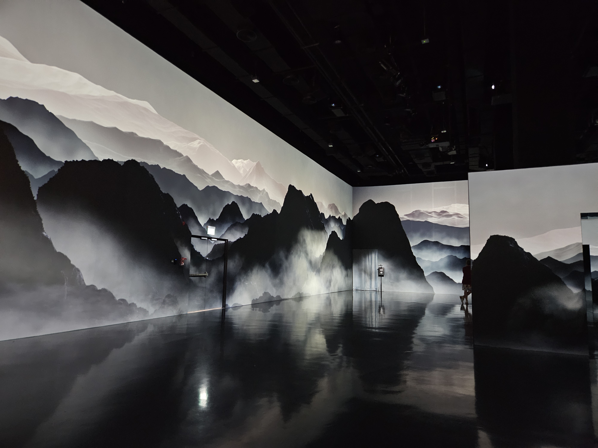

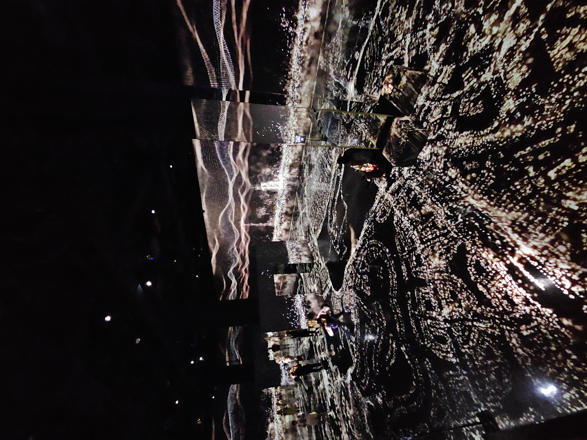

Post this was the visit to Burj Khalifa and thank the stars that I booked floor 148 which included a premium entrance. If one is to stand in the general queue during peak hours, my guess is it would take someone at least 2 hours to enter the building. I had particularly booked a prime slot as I wanted to see the sunset from the 148th floor. But in hindsight, this could’ve been avoided by visiting the building early around 9 AM. This is because the sunset view gets refracted multiple times due to the multiple layers of thick glasses placed and we end up seeing 2 suns. I’d say viewing the sunset at the palm is still better. An added benefit of going to the 148th floor is the complimentary refreshments and water bottles.

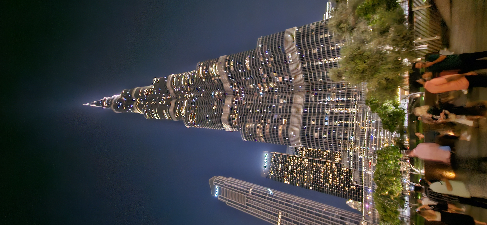

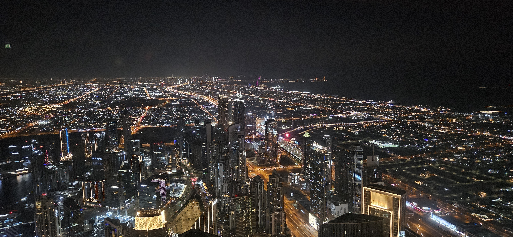

The day concluded wonderfully through a boat ride in the lake below the Burj Khalifa which included a musical fountain show too. 

# Day 3

The first stop for the day was the Museum of the Future. I had to buy the premium priority pass tickets as the regular tickets were booked. This gave the impression that the Museum must be excellent and it did not disappoint. As with the Burj Khalifa, we entered directly courtesy of our tickets. The Museum is a concept of how Earth and Dubai might look in 2071. Another must-visit place in Dubai.

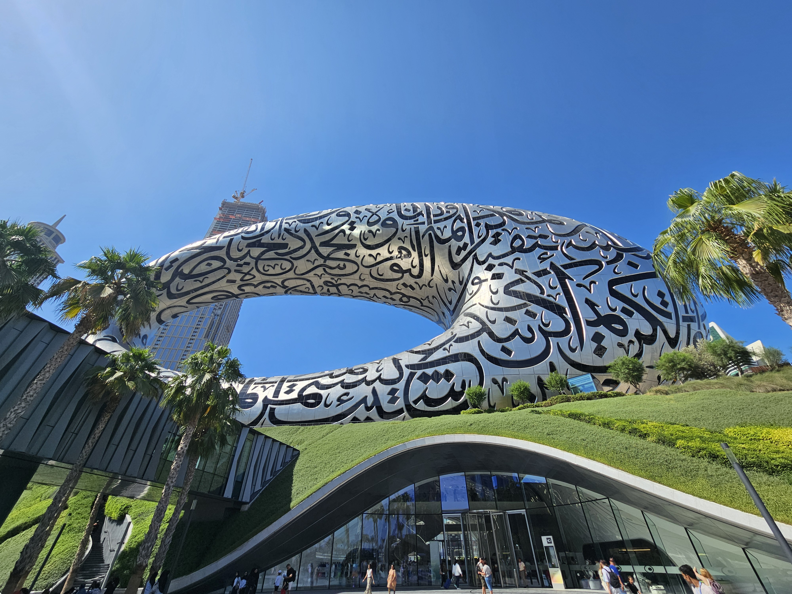

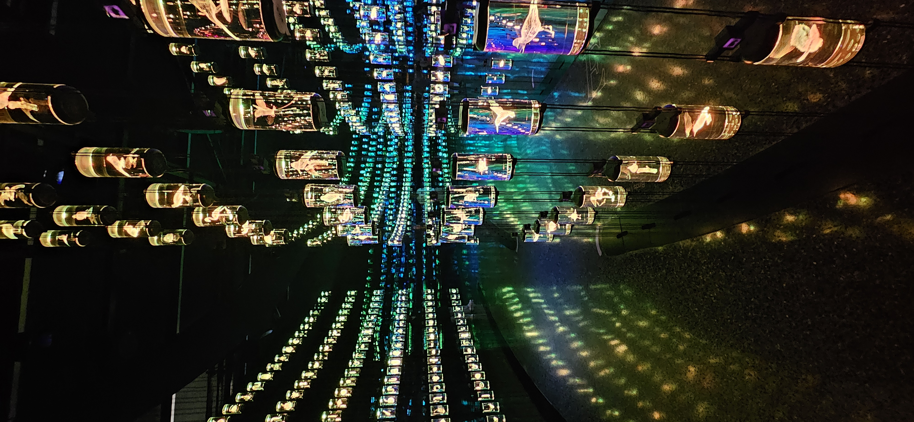

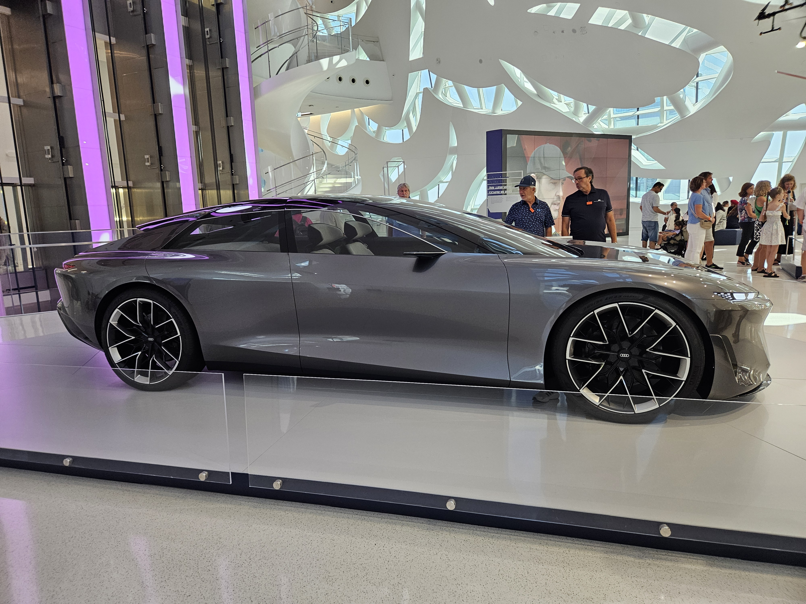

Next stop, Dubai Frame. Another high-rise structure with a view of old Dubai on one side and the new one on the other side.

The day ended early after we visited the dolphinarium at the creek, as we were travelling to Abu Dhabi the next day for my most anticipated event. The Dolphin and Seal show was nice, and I feel that I have to learn how to train animals to jump out of hoops someday.

# Day 4
The day was finally here. The day I would visit the Yas Marina Circuit and drive a car around. We got on the metro, reached the Ibn Battuta bus stop, got on a bus to AUH, and then took a taxi to the circuit. I do drive around F1 cars on my PS5, but nothing could’ve prepared me for what welcomed me there. The sound of V6 3.0L Jaguar engines roaring in all their glory instantly made me feel like I was home. The lobby had Porsches, Alfa Romeos, AMG, and even a safety car used in an actual GP.
	
After registration, getting dressed, and the debrief, it was finally time to get in the car. The Tata Nexon EV Max, which could go from zero to one hundred km per hour in ten seconds at most, was the most potent vehicle I had ever driven. Here I was riding in a car that could go from 0 to 100 km per hour in 2.8 seconds thanks to its V6 3.0L engine outputting 260 horsepower. For a brief moment, the strength beneath my right foot nearly rendered me numb. As soon as the first lap began, I was yelling nonstop with excitement as we went past the Yas Marina's north circuit. The pinnacle was when I was at the start-stop straight and all those images of Hamilton’s championships being won; Alonso, Vettel, and Hamilton doing doughnuts; and many such moments popped up in my head, which I had seen only on television and I was overcome with a sense of immense joy, excitement, awe, and satisfaction. 

Post this, it was time to get in the groove and make the most of every second of 900 seconds available to me in the car on the track. Due to my likely pacy behaviour in comparison to the three participants in my slot, I was momentarily stopped and made to go out alone with an instructor. This was the best thing that could probably have happened as the instructor slowly started pushing me to my limits and I started consistently hitting ~200kmph in the main straight and improving my lap times through better cornering. The crowning moment was at the end of my session when the instructor in front, gave me a big thumbs up which I subsequently learnt wasn't given to everyone. 
	
Unfortunately, the circuit only gives you the video of your best lap time and no other stats. [Here is the Video](https://youtu.be/B41xZiza-Fg) and a few pictures of the car and the circuit.

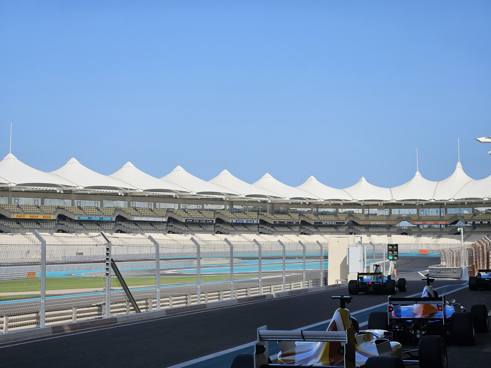

I did not know how any other experience that I had remaining on the trip could be better than this and with this thought running in my mind, we visited Ferrari World, went on a few roller coasters, and a few other rides. Unfortunately, the Formula Rossa was closed for maintenance and I couldn’t get to experience the world’s fastest roller coaster pulling up to 5G’s.

My parents always wanted to sit in a sports car and Ferrari World provided the best opportunity to date. A passenger experience in a Ferrari Portofino, and they loved every second of it. The day in Abu Dhabi concluded after clicking a few pictures of Michael Schumacher’s championship-winning cars and the Ferrari Monza SP1.

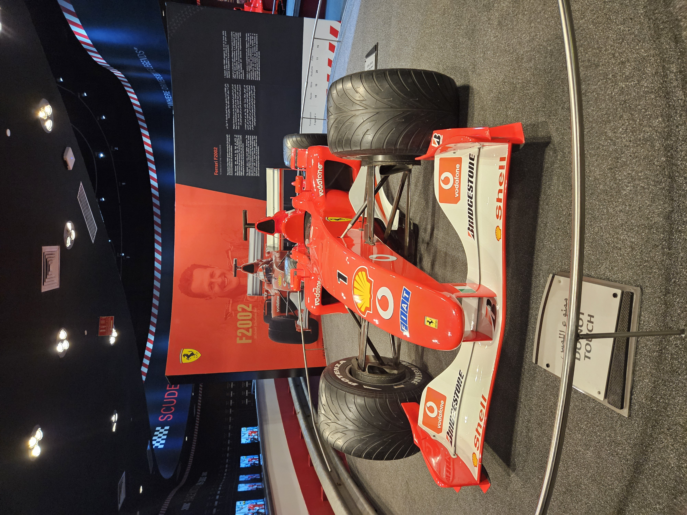

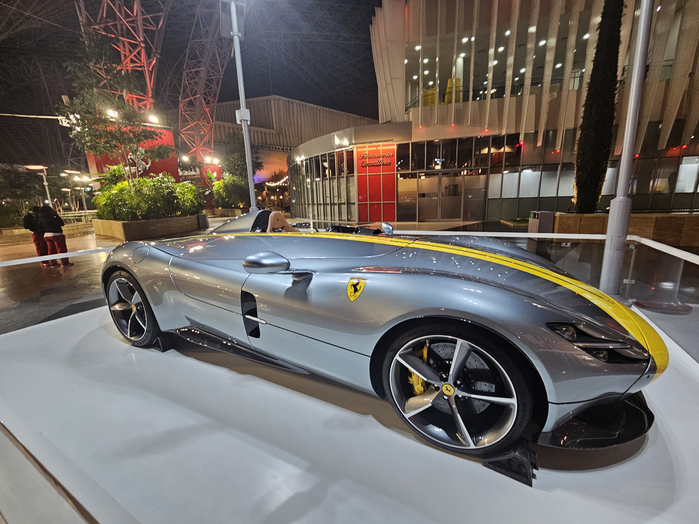

# Day 5
A day where I completed another bucket list item of jumping off a plane. I had booked a skydive at the Palm. A plane takes us to 14,000 feet from where the tandem jump starts. Initially, there is a freefall of about 9000 feet which is covered in ~50 seconds. This means the freefall essentially happens at ~200kmph and this almost rivalled my previous day experience. [Here is the video](https://youtu.be/gaiwExsPJDg) and below are some photos.

After lunch, it was time for the speedboat experience and for a guy who had just fallen off a plane and driven a car at 200kmph, no matter how fast the boat went, it felt like a stroll in the park. But never the less, it was a good experience and one can even think of renting a yacht.

Later we spent the evening at the Dubai Marina Mall and proceeded towards our Dubai Dhow Dinner cruise. There are options here, one is the dhow cruise and the other is the marina one and I’d suggest going for the marina one for a better view of Dubai. 

# Day 6
There wasn’t much planned for the remaining two days of the trip. The morning of Day 6 went by visiting Dubai’s Miracle Garden. The sun had been kind to us to date and this was the first time we experienced the heat of Dubai. The second half of the day was booked for the desert safari. Keep in mind that the time mentioned in the booking may be different from the actual time. We were accompanied for the safari by a lovely Italian family and this concluded Day 6.  

# Day 7
Coincidentally, my friend Adyanth was on a family trip to Dubai and we decided that we should do something together. Ice skating was the solution to this. We met at the Dubai Ice Rink for what was my first skating experience. I’m proud to report that I was able to progress from being unable to stand without assistance to being able to complete one full round without help by the end.

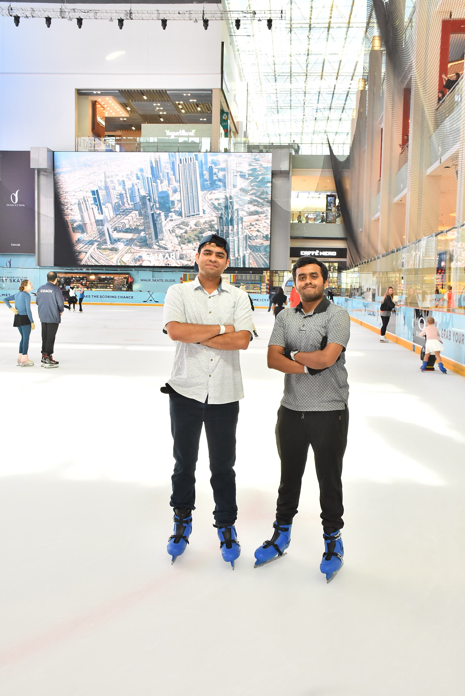

We did our farewell and it was time for the final leg of the Dubai trip. I had booked a taxi for a Dubai city tour which would take us to the Burj-Al-Arab, the Spice Souk, and the Gold Souk, before dropping us at the airport. This was a low-key end to my adventurous Dubai trip.

Due to the lack of time, I couldn’t visit many places like the IMG Adventure Park, Ski Dubai, and so on…

As the Airbus A380 took off which was even more luxurious than the Boeing 777, my thoughts were only of how soon I would be able to return to this amazing location and spend a few more days there, as well as how thankful I felt for the seven days I had already spent there by saying Adios Dubai. Thank you for the memories!!

