Towards the end of December 2023, my parents and I took up this road trip in my Tata Altroz where we visited a few holy shrines and historical places across Karnataka. I’ve written about the trip below and all the expenses mentioned are in INR.

## Plan
The plan originated from my mother when I was doing my master’s when she wanted to visit Horanadu Sri Annapoorneshwari temple and the Sringeri Sharadamba temple after I completed my master's. Having graduated in July 2023, the plan finally materialized in December 2023. I wanted to Visit Hampi for a long time and hence we decided that we’d go to the Kukke Subramanya Temple, Sri Dharmasthala Manjunatha Temple, Hornadu Sri Annapoorneshwari Temple, Sringeri Sharadamba Temple, and then visit Hampi. Chitradurga being on the way from Sringeri to Hampi, provided us with another place to visit.

## Itinerary and Logistics
For anyone interested, I’ve made a table below of how much we spent on our stay, food, and travel. I’ve also written a rough travel itinerary of when we visited each of these places. The expenses mentioned are for three people.

Travel Itinerary

|     Day    |     Time        |     Place                                                                                        |
|------------|-----------------|--------------------------------------------------------------------------------------------------|
|     1      |     12 pm       |     [Kukke Sri Subramanya Swamy Temple](https://maps.app.goo.gl/qjNdRe9w9xL63fVm9)               |
|     1      |     5 pm        |     [Sri Dharmasthala Manjunatha Swamy Temple](https://maps.app.goo.gl/u5uMa9j6MLJKKHqU6)        |
|     2      |     10:30 am    |     [Horanadu Sri Annapoorneshwari Temple](https://maps.app.goo.gl/xpeLBb8RUrW82sau6)            |
|     2      |     3 pm        |     [Sringeri Sharadamba Temple](https://maps.app.goo.gl/XXDNRbkFYy4ScrzH8)                      |
|     3      |     11 am       |     [Chitradurga Fort](https://maps.app.goo.gl/AbgeNXcYXeYUbbcC9)                                |
|     3      |     5 pm        |     [Tungabhadra Dam, Hospet](https://maps.app.goo.gl/xtK3NDpqzT9RE2Kc8)                         |
|     4      |     9 am        |     [Vittala Temple, Hampi](https://maps.app.goo.gl/VbPJVSNZxnTeBW9u6)                           |
|     4      |     1 pm        |     [Queen’s bath house, Hampi](https://maps.app.goo.gl/9MY57XZk21tCMP257)                       |
|     4      |     1:30 pm     |     [Lotus Mahal, Hampi](https://maps.app.goo.gl/sWULF7UDnuyRn7na6)                              |
|     4      |     3:30 pm     |     [Sri Virupaksha Temple, Hampi](https://maps.app.goo.gl/NZ8Zhr1NNkjUqrHz5)                    |
|     4      |     5:30 pm     |     [Hazara Rama temple and nearby ruins of Hampi](https://maps.app.goo.gl/MyHsDqJn8zYnvNACA)    |

Food

|     Day      |     Place                                                                                     |     Reason       |     Expenditure    |
|--------------|-----------------------------------------------------------------------------------------------|------------------|--------------------|
|     1        |     [Udupi Grand, Kushalanagara](https://maps.app.goo.gl/uqHBFQGNjMqtUv8v9)                   |     Breakfast    |     248            |
|     1        |     [Neo Mysore Café, Kukke Subrahmanya](https://maps.app.goo.gl/DiRmeQ9PJmgJGzSw9)           |     Lunch        |     440            |
|     1        |     [Ananda Wellness and Resorts, Dharmasthala](https://maps.app.goo.gl/qiQm5GZL1X5DKEdN6)    |     Dinner       |     911            |
|     2        |     [Nisarga Grand](https://maps.app.goo.gl/fzFAeDh7A2bmPUV39)                                |     Breakfast    |     250            |
|     2        |     [Horanadu Sri Annapoorneshwari Temple](https://maps.app.goo.gl/xpeLBb8RUrW82sau6)         |     Lunch        |     N/A            |
|     2        |     Sringeri Street food                                                                      |     Snack        |     100            |
|     2        |     [Akash Inn, Shivamogga](https://maps.app.goo.gl/BCiofrcvSXhT5MMm6)                        |     Dinner       |     1129           |
|     3        |     [Updadhya Veg, Chitradurga](https://maps.app.goo.gl/NRxcQDroLyKDbpGcA)                    |     Lunch        |     425            |
|     3        |     [Hotel Krishna Palace, Hospet](https://maps.app.goo.gl/VJYz9oeep3bJfVqW6)                 |     Dinner       |     1254           |
|     4        |     [Mango Tree Restaurant, Kamalapura](https://maps.app.goo.gl/ZowGxJy5JrfH2xjA7)            |     Lunch        |     575            |
|     4        |     [Hotel Krishna Palace, Hospet](https://maps.app.goo.gl/VJYz9oeep3bJfVqW6)                 |     Dinner       |     1203           |
|     5        |     [Paakashala, Sira](https://maps.app.goo.gl/jurGk3FcNtN5us2G6)                             |     Lunch        |     798            |
|              |                                                                                               |     Total        |     7243           |

Hotels (All bookings done through makemytrip.com)

|     Day      |     Place                                                                                     |     Breakfast included    |     Expenditure    |
|--------------|-----------------------------------------------------------------------------------------------|---------------------------|--------------------|
|     1        |     [Ananda Wellness and Resorts, Dharmasthala](https://maps.app.goo.gl/qiQm5GZL1X5DKEdN6)    |     No                    |     3713           |
|     2        |     [Akash Inn, Shivamogga](https://maps.app.goo.gl/BCiofrcvSXhT5MMm6)                        |     Yes                   |     3632           |
|     3,4      |     [Hotel Krishna Palace, Hospet](https://maps.app.goo.gl/VJYz9oeep3bJfVqW6)                 |     Yes                   |     16104          |
|              |                                                                                               |     Total                 |     23449          |

Travel Logistics

As mentioned earlier, this was done in my Tata Altroz. We covered a total distance of 1225.8 km and I managed this at an average of 17.5 kmpl. Considering an average of 103 rupees per litre during the time of travel, the fuel costs came to 7215 rupees. The road toll cost another 715 rupees. Thus, the travel expenditure came to 7930 rupees.

## Experiences
We started from our home in Mysuru around 7 am on day 1, had breakfast at Kushalnagar and reached Kukke Subrahmanya around 11:30 am. We were in for a big surprise seeing the number of devotees already in the queue for the Darshan. Thus, we moved towards the Sri Adi Subrahmanya temple where we finished our darshan and returned to the Kukke Subrahmanya Swami Temple. The crowd did not show any signs of easing up and we were informed that there was no special darshan option too. After inquiring around for a while, we came to know that if we donated 500 rupees per head towards Anna Dana (Meal service of the temple), we would be able to skip half of the queue. Thus, we paid 1500/- and entered the temple and our darshan was complete in the next hour. We finished our lunch at a local restaurant by 2:45 pm and started towards Dharmasthala.

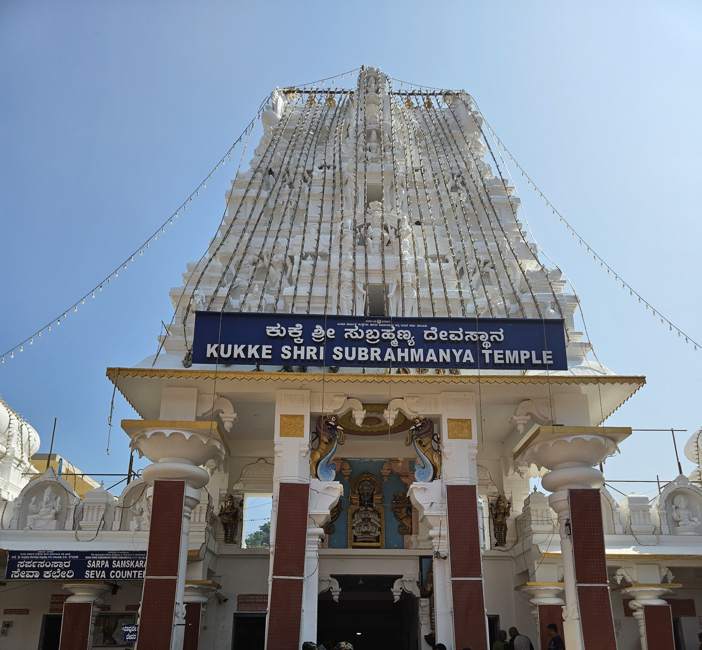

&nbsp;&nbsp;&nbsp;&nbsp;The place of our stay at Dharmasthala was about an hour’s drive from Kukke. We checked in to the hotel, got ready and reached the Sri Dharmasthala Manjunatha Swamy temple around 5 pm. One of my friends had visited the previous week and had told me that the crowd was huge, but his words did not do justice to reality. From the time we entered the special darshan queue by paying 200/- per head to the time we completed our darshan and came out of the temple, a whopping 4 hours 10 mins was spent in the queue. But it was worth it in the end, and we did get a glance at the legendary Veerendra Heggade while standing in the queue. We reached our hotel, had dinner and it was curtains on a long day 1 of the road trip.

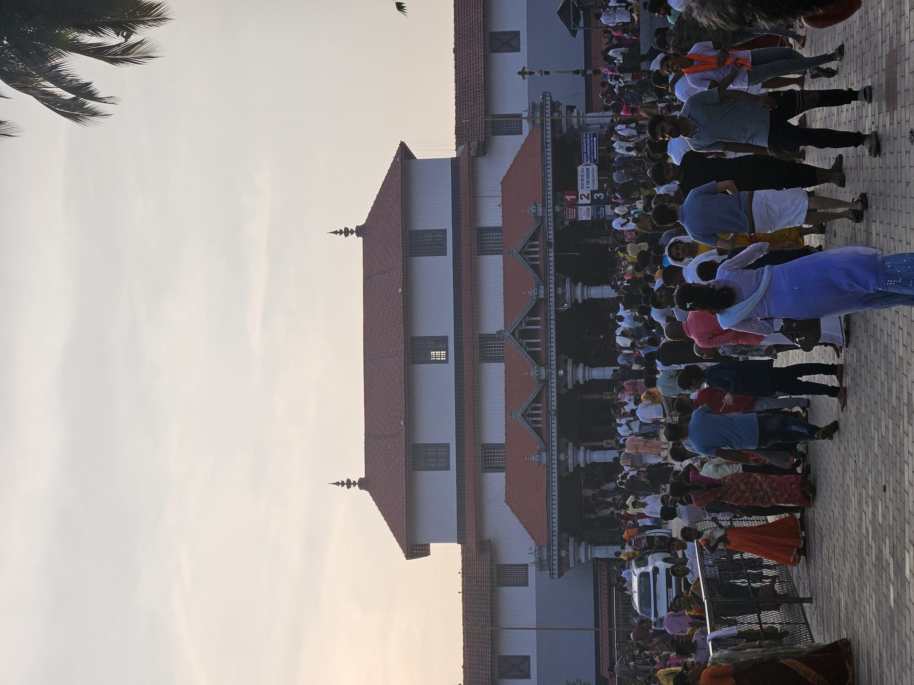
Entrance of the Sri Dharamasthala Manjunatha Swamy Temple

&nbsp;&nbsp;&nbsp;&nbsp;The second day started early at 6:30 am as we had planned to go to Horanadu, Sringeri, and then reach Shivamogga for the night. Horanadu is around 95km from Dharmathala, but it does take a long 3 hours to cover this distance as the road is full of curves and ghats. We reached the Sri Annapoorneshwari Temple at around 10:15 am after our breakfast and from the previous day’s experience, we were expecting the darshan time to be around 2 hours again. But looks like it was our lucky day. The darshan was done in less than 30 mins and we could spend the next 2 hours leisurely in the temple. We then finished our lunch at the temple ‘Anna Dana’ and started towards Sringeri.

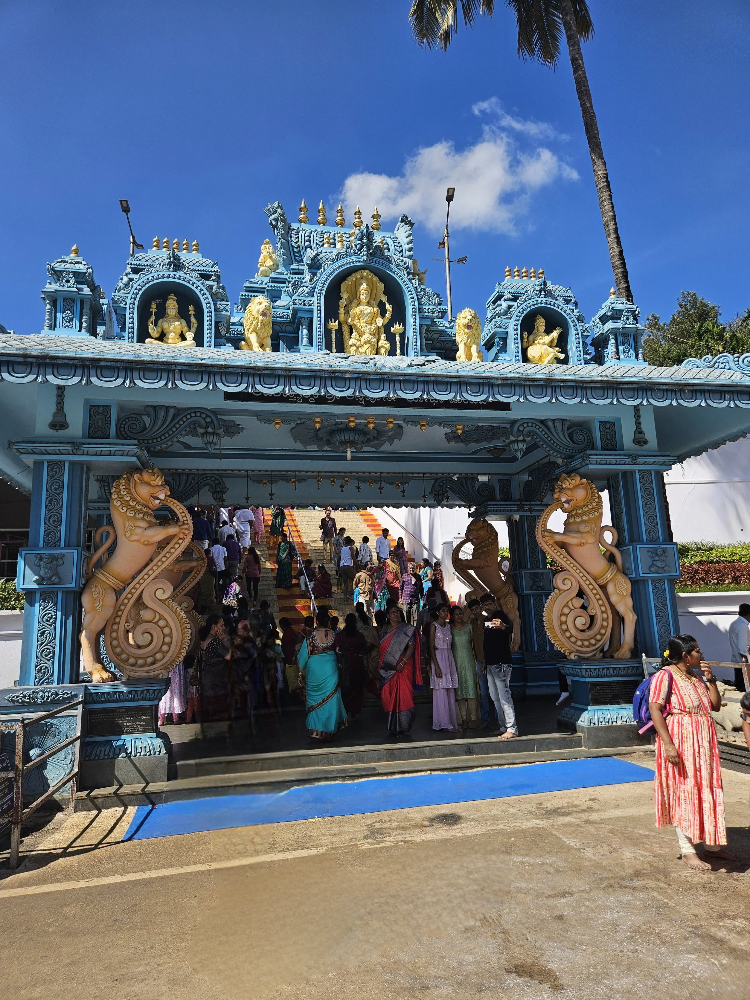
Entrance of the Sri Annapoorneshwari Temple

&nbsp;&nbsp;&nbsp;&nbsp;The road to Sringeri from Horanadu was the worst in the entire road trip as more than half the road was filled with stones, potholes, and dust. We did reach Sringeri by 3 pm and were expecting a wait till the temple reopened at 4 pm. But we did get even luckier as the temple was kept open to clear the additional crowd on the weekend. We reached our stay in Shivamogga around 7 pm. We covered the least distance on day 2, but this was the highest satisfaction of driving that I’ve ever had because of the continuous twists, turns, curves, and ghats throughout the day.  Also, probably the most tired that I ever got from driving.

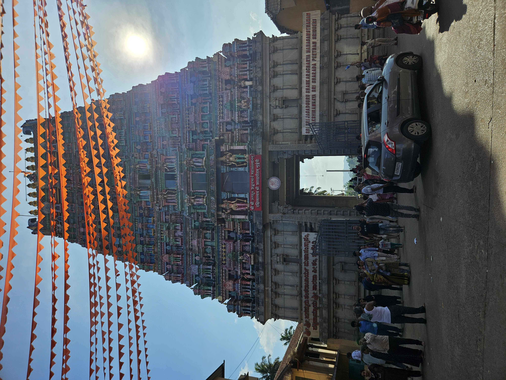
Entrance of the Sri Sharadamba Temple

&nbsp;&nbsp;&nbsp;&nbsp;Day 3 started with a 2-hour drive after breakfast at Shivamogga to Chitradurga Fort where we reached around 11 am. The fort is huge and is of historical significance. We hired a guide by paying 1200/- and he walked us through the nitty-gritty of the fort and the history involved and I must say, it was worth the money. The famous ‘Obbavana Kindi’ is located at the other end of the fort and the whole thing took us about 2 hours and 30 minutes to complete. After this, we finished lunch here and drove towards the Tungabhadra dam at Hospet. It was my first time visiting such a huge dam which has an active capacity of 116.86tmcft. The dam was probably around 60-65% full and it still looked like an ocean. I couldn’t comprehend how it would look when the dam is full and the water gushes out in full flow. We were also lucky to witness a very beautiful sunset there. Later we spent around an hour at the dam garden and called it a day after checking in to our stay at Hospet.

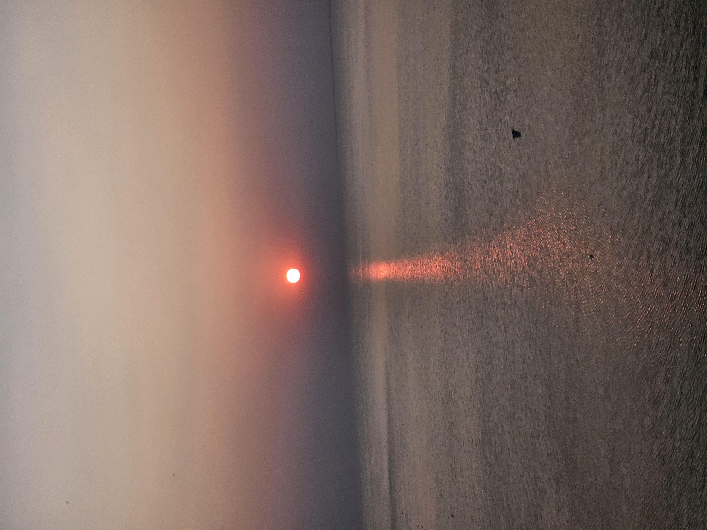

&nbsp;&nbsp;&nbsp;&nbsp;The day I visited Hampi was finally here. Hampi had reached its pinnacle under Sri Krishnadevaraya of the Vijayanagara Empire and it is believed that pearls and emeralds were sold on streets like common items and traders from all over the world came here for trade. The grandeur of Hampi during the Vijayanagara Empire was such that the Deccan and the Mughal sultanate which laid siege to Hampi after the fall of the Vijayanagara Empire, looted and burnt the city for a whopping 6 months. This is a nice [YouTube video]( https://youtu.be/HZPEdjr5T1Q?si=INu6BKdRdVlG80aM) which talks about the history of Hampi.

&nbsp;&nbsp;&nbsp;&nbsp;The first point of our visit was the Vittala temple. This is where the famous Hampi stone chariot is located and my god, it does look magnificent. The place is full of history, and it was superbly explained in an hour by our guide whom we had hired by paying 800/-. We spent an additional hour there, soaking in the history and clicking a few pictures. After this, we visited the queen’s bath place, lotus mahal, and elephant’s stables before heading to lunch. After lunch, our first stop was at the Virupaksha temple which by itself is a marvel of architecture and engineering. Then we visited the Hazara Rama temple, the palace ruins, Mahanavami Dibba and a few other ruins which are located next to each other. At the end of the day, I was absolutely in awe of the people of the Vijayanagara Empire and the ones responsible for such architectural marvels and disgust towards those people who were responsible for destroying such magnificent heritage and history. It also left me wondering, what might have been the state of present India, had it not been subject to 1000+ years of loot and destruction.

&nbsp;&nbsp;&nbsp;&nbsp;I did want to visit the Almatti dam and the nearby places of Badami, Aihole, and Pattadkal. But given that it had been a 4-day tiring road trip, I did not want to further strain my parents and we started towards Mysuru the next day. It is around 420km to Mysuru from Hospet and we cruised home, satisfied with the trip that we had just taken.

Thank you for your time and hope this blog is useful to someone, someday.

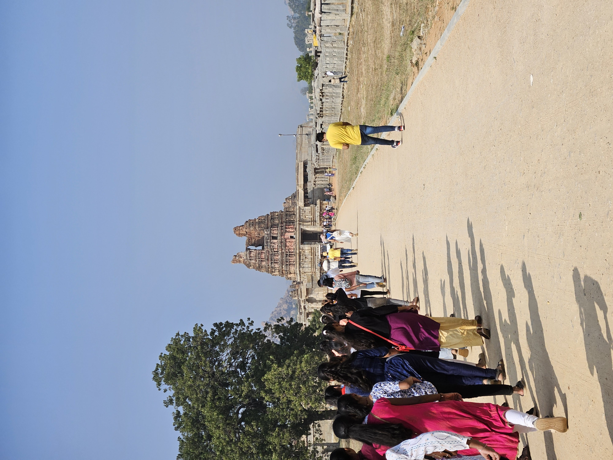
The pathway leading to the Vittala temple

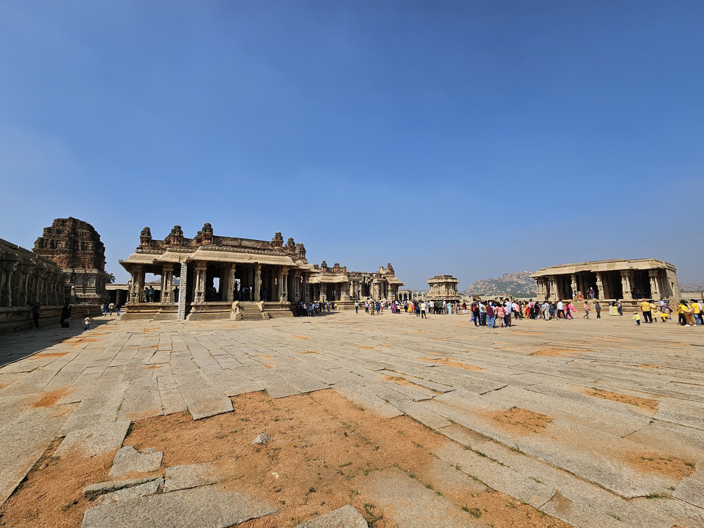
A wide-angle view from the inside of the Vittala temple

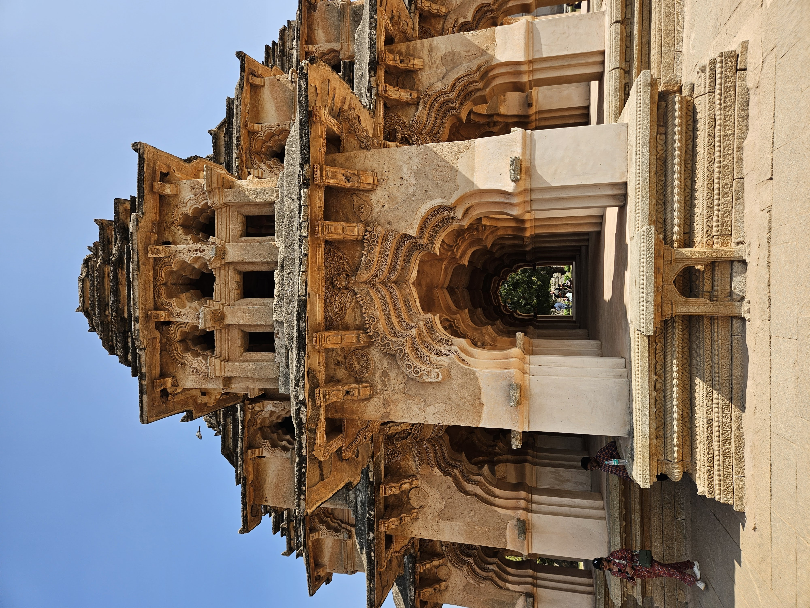
The lotus mahal is also the residence of one of the two wives of Vijayanagara ruler Krishnadevaraya.

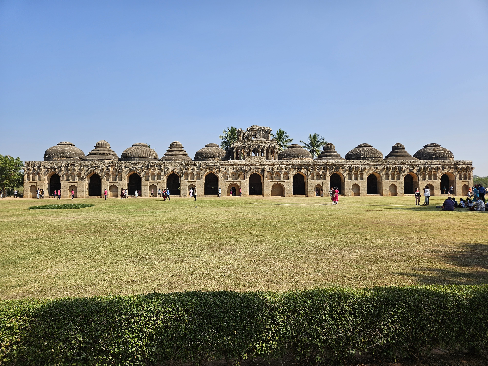
The Elephant Stable in Hampi is a structure that was used to provide shelter for the royal elephants of the Vijayanagara Empire

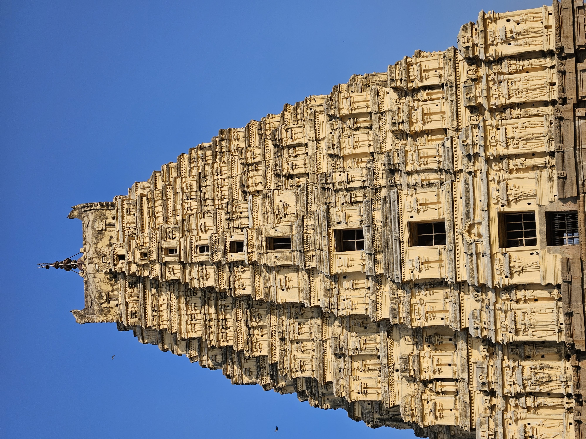
The Virupaksha temple Gopura

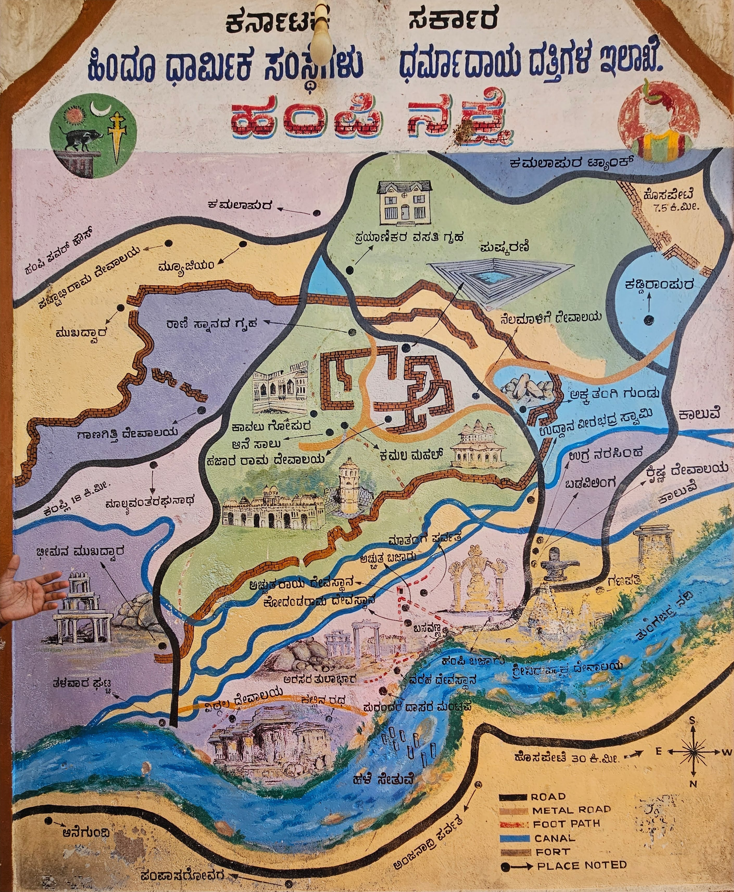
A map detailing the legendary Hampi

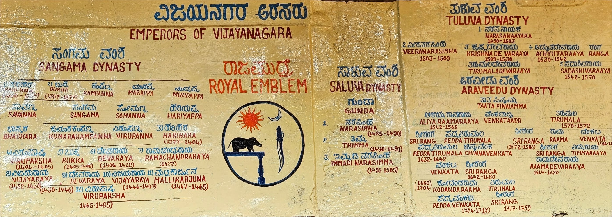
The kings who ruled Vijayanagara

