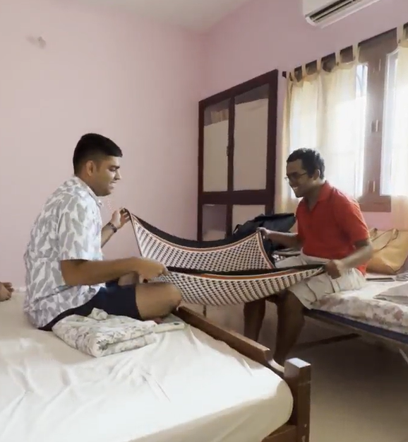
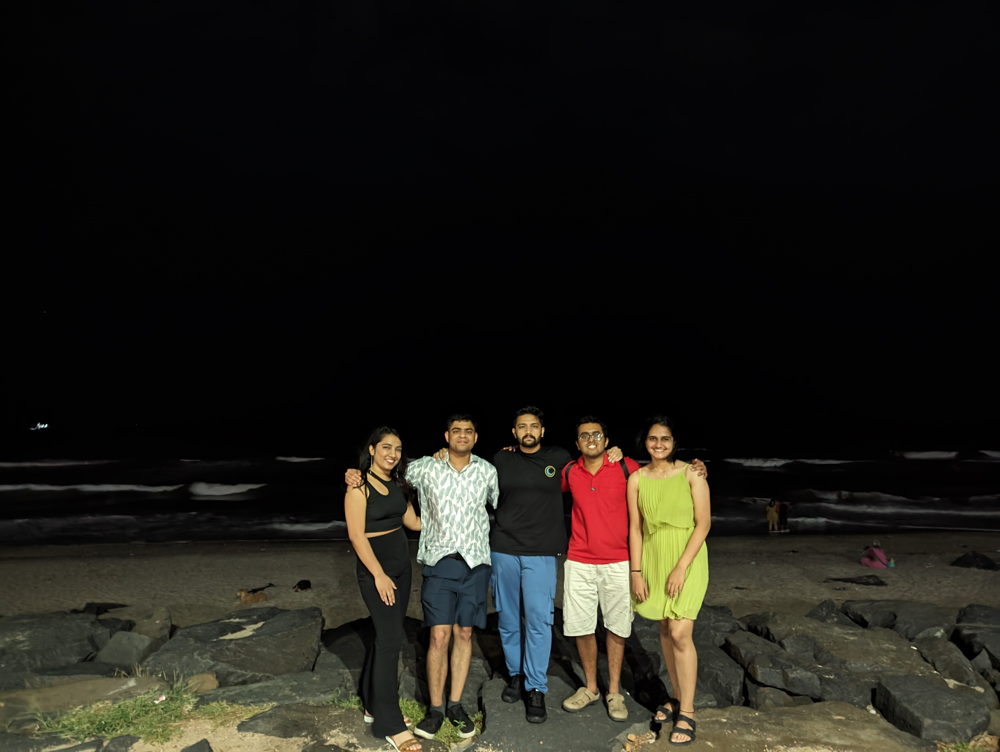
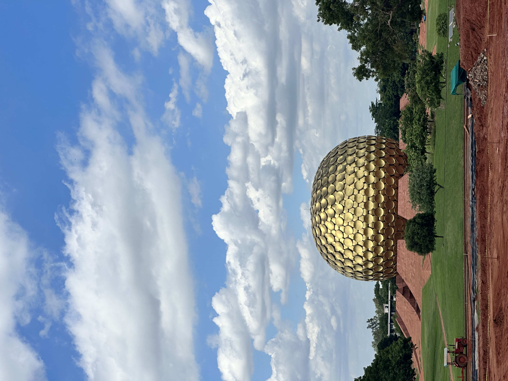
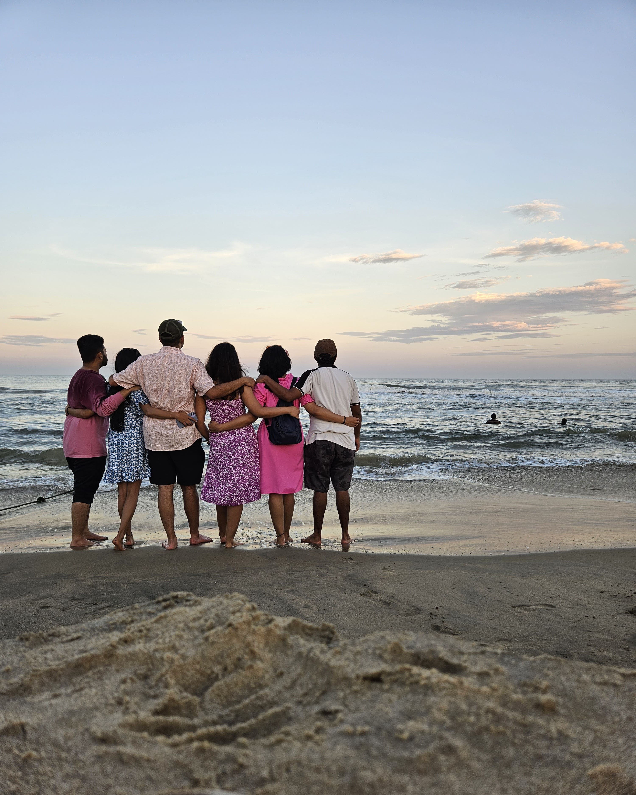
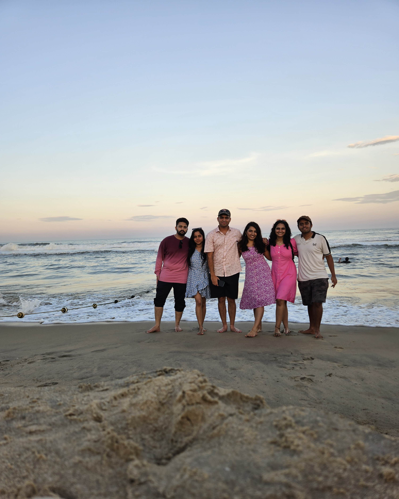
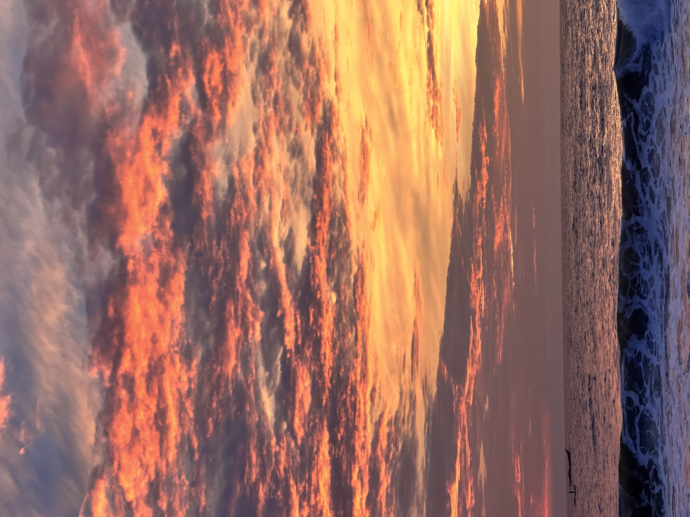

About 15 days have passed since I travelled to Pondicherry with some of my closest friends, bringing back a heart full of memories and a belly full of food. There were 6 of us in 2 vehicles, one of which was a Tata Altroz that had Meghana, Ruthuja, and I. The other was a Nexon EV max with Aniket, Adyanth, and Supriya. All the expenses reported are in INR.

## Plan
The idea of us going on a trip originated out of pure coincidence when Adyanth from the US and Meghana from the UK mentioned that they would come to India at the same time. After much deliberation on where to go, we narrowed in on going to Pondicherry since Adyanth, Aniket, and Supriya had not been there. I, Ruthuja, and Meghana had visited, so we had a fair idea of what to expect. We narrowed the dates to 14th to 16th September and we preferred to have an economical vacation (Ultimately ended up splurging on food). So, we booked the same [Airbnb](https://www.airbnb.co.in/rooms/32482359?guests=1&adults=1&s=67&unique_share_id=b90244aa-1cdc-4517-883f-1f065910c13f) where we had stayed previously as it would cost us ~1000 for the 2-night stay. The travel in 2 cars was expected to be around 1500 per person. Aniket came up with the trip itinerary and did a wonderful job at it.

## Itinerary
For anyone who’s interested in knowing what our itinerary was, I have made a simple list below along with how much we spent there if applicable. Whatever I’ve mentioned in the expense column is the total expenditure for 6 folks and individual shopping expenditure has not been considered. N/A in expense implies it was a treat by Adyanth.

Food Itinerary

| Place                                                                        | Reason       | Expense | Day |
|------------------------------------------------------------------------------|--------------|---------|-----|
| [Hotel Hills](https://maps.app.goo.gl/CjCTVLTu4pa4MFF87)                     | Breakfast    | 2514    | 1   |
| [Saravanna Bhavan](https://maps.app.goo.gl/THzEFw95Xvo3M3WX6)                | Lunch        | 510     | 1   |
| [Cozy Resto Pub](https://maps.app.goo.gl/P4bhmJfXeQakC5UJA)                  | Dinner       | 4905    | 1   |
| [Gelato factory](https://maps.app.goo.gl/5X7B4Y4w5VjcMdQT7)                  | Ice cream    | N/A     | 1   |
| [Auro Jars bakery and Restaurant](https://maps.app.goo.gl/SZXHLYA4RyoFTJmQ8) | Breakfast    | 997     | 2   |
| [Dreamer’s café](https://maps.app.goo.gl/saSqh5ZnJTBVQD9G6)                  | Lunch 1      | 570     | 2   |
| [Coromandel Cafe](https://maps.app.goo.gl/x1jodo8goPZJssn58)                 | Lunch 2      | 2515    | 2   |
| [Escape In](https://maps.app.goo.gl/FD8oiFFCadiU7e247)                       | Dinner       | 2639    | 2   |
| [Gelateria Montecatini Terme](https://maps.app.goo.gl/LaeZUNLJsCdezw9a7)     | Ice cream    | 700     | 2   |
| [Baker Street](https://maps.app.goo.gl/x5PrUq7ryxKZ2meKA)                    | Breakfast    | 2678    | 3   |
| [Saravanna Bhavan](https://maps.app.goo.gl/THzEFw95Xvo3M3WX6)                | Lunch        | 720     | 3   |
| [Regency](https://maps.app.goo.gl/QVAWfoMM4mijMpac9)                         | Dinner 1     | 2407    | 3   | 
| [Surya Complex](https://maps.app.goo.gl/XByZT3Nn7go2AQfj8)                   | Dinner 2     | 754     | 3   |
|                                                                              | Miscallaneous| 1008    | 1-3 |
|                                                                              | Total        | 22917   |

Travel Itinerary

| Place                                                                 | Time/Reason   | Day |
|-----------------------------------------------------------------------|---------------|-----|
| [Rock beach](https://maps.app.goo.gl/5kHLyJ6qiKfj1TJn6)               | Evening       | 1   |
| [Auroville Beach](https://maps.app.goo.gl/dDaa5vA2BYPRr4hj6)          | Sunrise       | 2   |
| [Matrimandir](https://maps.app.goo.gl/KnmuwbQYYoTxEMQ77)              | Morning       | 2   |
| [Eden Beach](https://maps.app.goo.gl/5X7B4Y4w5VjcMdQT7)               | Evening/Sunset| 2   |
| [Rock beach](https://maps.app.goo.gl/5kHLyJ6qiKfj1TJn6)               | Night         | 2   |
| [Auroville Beach](https://maps.app.goo.gl/dDaa5vA2BYPRr4hj6)          | Sunrise       | 3   |
| [Mangrove Forest boating](https://maps.app.goo.gl/gZx27oN2dfcBmW7W6)  | Morning       | 3   |

## Logistics
The toll costs came up to 1475 INR for each vehicle to and fro, with 640 of these for the Mysuru-Bengaluru expressway and 290 for the NICE road from Kengeri to Electronic City/Hosur Road. Our stay cost us 1500/- per night per room and we had booked two rooms. The petrol cost us 6079/- at 17.8kmpl at 103 per litre. The EV charging break-up is as below. All chargers of type CCS-2. Also, the EV was charged initially to 100% before starting on the 14th.

| Date | Place                                                           | Charger capacity/Provider | Cost  | Units Consumed | Time spent charging in minutes | Activity |
|------|-----------------------------------------------------------------|---------------------------|-------|----------------|--------------------------------|----------|
|14    | [Hotel Hills](https://maps.app.goo.gl/CjCTVLTu4pa4MFF87)        | 30kW/Tata                 | 691.95| 32.950         | 87                             | Breakfast|
|14    | [Krishnagiri](https://maps.app.goo.gl/yVKcbetdY1iqCXWJA)        | 30kW/Tata                 | 190.66| 9.079          | 27                             |          |
|14    | [Saravanna Bhavan](https://maps.app.goo.gl/THzEFw95Xvo3M3WX6)   | 50kW/Zeon                 | 683.33| 27.44          | 66                             | Lunch    |
|16    | [Ginger Pondicherry](https://maps.app.goo.gl/YW3bZQt2ruduG6Gc6) | 30kW/Tata                 | 586.74| 27.940         | 88                             | Breakfast|
|16    | [Saravanna Bhavan](https://maps.app.goo.gl/THzEFw95Xvo3M3WX6)   | 50kW/Zeon                 | 336.13| 13.5           | 32                             | Lunch    |
|16    | [Regency](https://maps.app.goo.gl/QVAWfoMM4mijMpac9)            | 24kW/Zeon                 | 593.39| 25.91          | 102                            | Dinner 1 |
|16    | [Surya Complex](https://maps.app.goo.gl/XByZT3Nn7go2AQfj8)      | 50kW/Zeon                 | 612.29| 24.59          | 60                             | Dinner 2 |
|16    | [kengeri](https://maps.app.goo.gl/LjrqVoqQoauVxbLV9)            | 24kW/Zeon                 | 89.2  | 5.95           | 17                             |          |
|      |                                                                 | Total cost                |3783.69|
|      |                                                                 | Total cost with GST       |4467.75|

## Experience
I started off day one on the 14th at around 6:15 AM from my home in Mysuru, picked up Meghana on the way and proceeded towards Kengeri metro station in Bengaluru where Ruthuja would reach, and we would rendezvous. The EV had an hour’s head start to accommodate the additional time it would require charging the vehicle and we had expected to catch up to them somewhere near Krishnagiri. But as it turned out, we ended up reaching Hotel Hills just as they were about to leave having charged the car to 100%. They had another pit stop planned at Krishnagiri to charge and both the cars were expected to meet at Saravanna Bhavan, Tindivanam for Lunch. We three spent about an hour at breakfast and started on the ~190km drive to Tindivanam where our stop was planned for lunch, but we did reach there, earlier than the Nexon. After finishing our lunch both cars proceeded towards our stay in Pondicherry, and we reached there around 3:30 PM.

&nbsp;&nbsp;&nbsp;&nbsp;We had around 2 hours to kill in our room before we headed towards Rock Beach. Few wanted to get some rest, and few wanted to freshen up, but me and Adyanth, decided to recreate some standing waves and a time-space continuum using the revolution of the earth around the sun as an example using Supriya’s stole and a tennis ball that I had packed. But ended up failing miserably. Below is a small snippet of us trying it.

&nbsp;&nbsp;&nbsp;&nbsp;Anyway, after our failed attempt, all of us somehow packed ourselves into the EV, found a parking spot with great difficulty at white town and reached Rock Beach. It was as peaceful as ever until Meghana and Ruthuja asked me and Adyanth to stop talking and Adyanth decided to go on a silent protest. This carried on for a while until we reached our dinner place. Things got back to noisy normal again. We finished dinner and went to get ice cream from the Gelato factory which I was told, serves vegan-flavoured ice creams. I was a bit indecisive about how I felt about the taste, but anyway, we finished and went back to our Airbnb around 10:30 PM. We started chitchatting and before we realized it, 3 hours had passed, and we decided to call it a day. Below is a nice picture clicked by Supriya on our eventful visit to Rock Beach.

&nbsp;&nbsp;&nbsp;&nbsp;It was quite an early start to the day as we wanted to go catch the sunrise at Auroville Beach. But as it turned out, it was a struggle to wake up having had only 3 hours of sleep in the past 24 hours and hence Aniket and Adyanth decided to give the sunrise a miss and it was just me and the girls. We reached the beach, just as the sun was about to rise and the lack of clouds did give a very nice view of the sunrise. We spent an hour there before returning to get some more sleep. I was hungry and it was the girls’ time to sleep this time. Me and the boys finished our breakfast (the food was not that great), got some food packed for the girls and brought it to our rooms.

&nbsp;&nbsp;&nbsp;&nbsp;The temperatures outside felt like 40-42 degrees Celsius at around 11:30 AM and having visited Matrimandir already, Ruthuja and Meghana, decided to give it a miss. The rest of us visited Matrimandir; no meditation was involved as we had not pre-booked it. We walked one way for around 2 to 2.5 km to view the dome (photo below) and returned by bus. I was hungry, so we had a small snack at the same place before proceeding towards Coromandel café after picking up Ruthuja and Meghana on the way from our stay. I must say, the ambience of the place is lovely. Not many options in terms of food for vegetarians though. But whatever was available, was good and my talking here doesn't justify the vibes of the place. 

&nbsp;&nbsp;&nbsp;&nbsp;Next, our plan was to visit Eden Beach. Me and Adyanth did bicker for a while about who’ll drive there, but what’s a vacation without a fight :). Eden Beach is classified as one of the blue flag beaches and boy was it worth it. The cool breeze from the sea along with the sun setting towards our backs, the atmosphere turned out to be magical and we were able to click many pictures among which the below two are my favourite.

&nbsp;&nbsp;&nbsp;&nbsp;The beach closed around 6:30 PM, and we finished our dinner at Escape In and got some ice cream at Gelateria Montecatini Terme and returned to rock beach when it started drizzling.  I can’t put a finger to it and I'm not sure why, but this is one of those beaches where I feel the peace and tranquillity seeping through my body and feel like visiting it again and again and again... We spent over an hour there again, before having to return to our rooms as we had a travel day coming up. Almost immediately after returning around 11 PM, all of us dozed off.

&nbsp;&nbsp;&nbsp;&nbsp;It was yet another early start to the day and this time, the entire gang did not want to miss the sunrise. Everyone was awake and ready by 5:30 AM and we reached Auroville beach by 5:50 AM for sunrise. Although it was much cloudier than the previous day, the sun did make a guest appearance for a few minutes, and we got some beautiful pictures during this. Below is one such one where it looks like the sun has just ignited the sky with his fury.

&nbsp;&nbsp;&nbsp;&nbsp;Once done with the sunrise, we went to our rooms, packed, checked out, and reached Baker Street for breakfast and the taste was the same as 4 years ago, simply lovely. Having finished breakfast, and charged the EV to 100% at Ginger Pondicherry, our next destination was the mangrove forests which we wanted to explore, but unfortunately, after reaching the destination through some insane traffic, we were made aware that there is no water, and hence boating has been closed. The situation was so grim that we could see a person walking there in ankle-deep water :(

&nbsp;&nbsp;&nbsp;&nbsp;This was all that we had planned for Pondicherry, and we started our long journey back. Adyanth suggested that we take a slightly longer route to enjoy the drive a bit more and it was just what I wanted. We started around 2:30 PM from Pondicherry and ended up reaching Mysuru at 2:30 AM, the next day. The drive back was long, but it was worth it. Every minute of that drive by Ruthuja and with Meghana is something that I will hold very dear to me. Even though the trip was coming to an end, all that I could think of was how lucky I was to have been able to spend the past three days with these five amazing people who had seen me, been with me, and stood by me through the most difficult and the happiest of times of my life.

&nbsp;&nbsp;&nbsp;&nbsp;S.E. Hinton in one of her quotes mentions “If you have two friends in your lifetime, you're lucky. If you have one good friend, you're more than lucky.” So, what am I, who has so many people to look out for him and be there for him when needed?

Thank you for your time and hope this blog is useful to someone, someday.