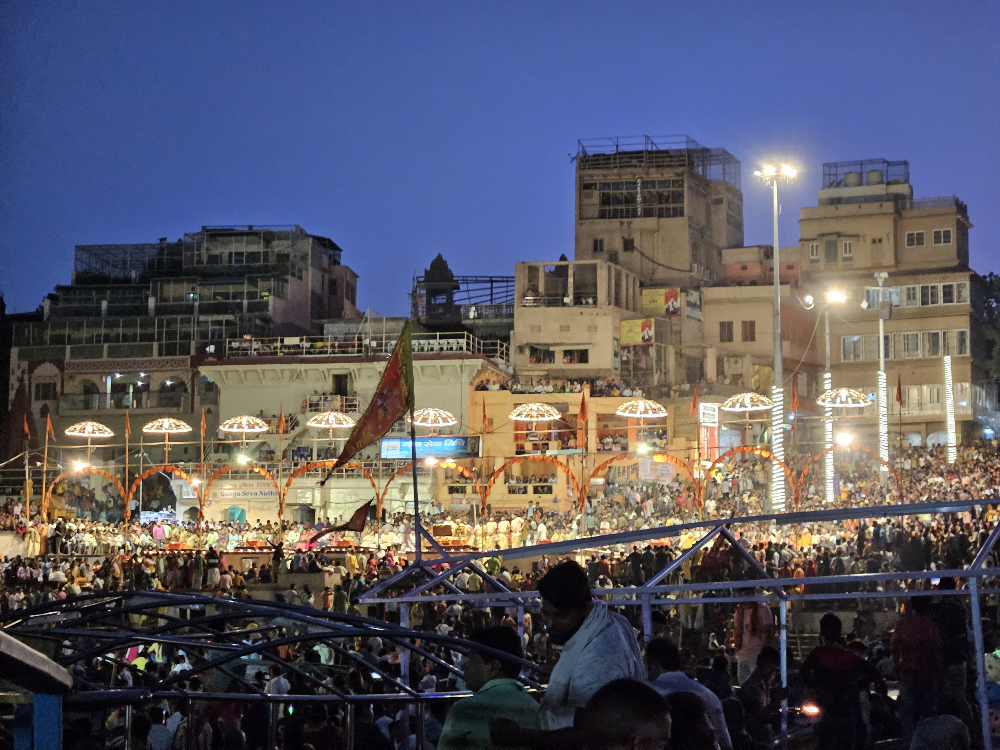
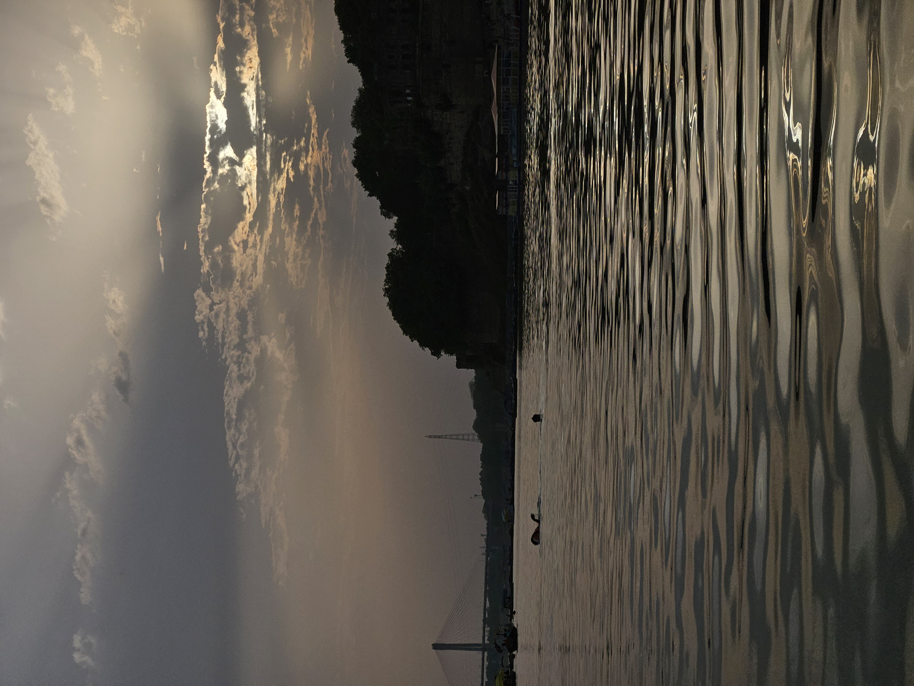

This is an experience written by my grandfather on our trip to Varanasi. Hope you have a good time reading this.

ನಮ್ಮ ಮೊಮ್ಮಗ ಮುರಳಿಯ ಎಮ್.ಟೆಕ್. ಕಡೆಯ ಅರ್ಧ ವಾರ್ಷಿಕ ಪರೀಕ್ಷೆ ಅಧ್ಯಯನದ  ಕಡೆಯಲ್ಲಿ ಪ್ರಾಜೆಕ್ಟ್ ನ ಅಂತರ್ಜಾಲ ಮಂಡನೆಯನ್ನು( ಪಿಪಿಟಿ )13-6-23ಕ್ಕೆ ನಿಗದಿಪಡಿಸಲಾಗಿತ್ತು.  ನಂತರ ಕೆಲವು ದಿವಸಗಳ ಬಿಡುವು ಪಡೆದು ಎಲ್ಲಿಗಾದರೂ ಪ್ರವಾಸ ಹೋಗಬೇಕೆಂಬ ಅಪೇಕ್ಷೆಯಿಂದ ತಂದೆ ತಾಯಿಯರೊಡನೆ ಚರ್ಚಿಸಿದಾಗ ದಿಲ್ಲಿ, ಆಗ್ರ,  ವಾರಣಾಸಿಯ ಹೆಸರುಗಳು ಪ್ರಸ್ತಾವವಾದವು.  ಆಗ ಅವನ  ತಾಯಿಯ ಮನಸ್ಸಿನಲ್ಲಿ ನಮ್ಮ ಕಾಶಿಯ ಪ್ರವಾಸವು ಅಲ್ಲಿಯವರೆಗೂ ಕೈಗೂಡದಿರುವುದು ನೆನಪಿಗೆ ಬಂತು. ಕೂಡಲೇ ದೂರವಾಣಿಯ ಕರೆ ಮಾಡಿ ತನ್ನ ತಾಯಿಯನ್ನು ವಿಚಾರಿಸಿದಳು. ನಾವಿಬ್ಬರೂ ಒಪ್ಪಿದ ನಂತರ ಒಂದು ಸ್ಥೂಲವಾದ ಯೋಜನೆ ತಯಾರಿಸಿ ವಿಮಾನಯಾನ ಮತ್ತು ವಸತಿಯ ಮಾಹಿತಿಗಳನ್ನು ಅಂತರ್ಜಾಲದಲ್ಲಿ ಹುಡುಕಿ ನಮ್ಮೊಡನೆ ಚರ್ಚಿಸಿದರು. ನಂತರ ನಾನು ವಸಂತ ಮತ್ತು ವಿಶ್ವನಾಥ  ( ಅವನಿಗೆ ಮಂಡಿ ನೋವಿದ್ದು ಫಿಜಿಯೋಥೆರಪಿ ಪ್ರಾರಂಭವಾಗಿತ್ತು)   ಅವರು ಕಾಶಿಗೆ ಬರಲು ಸಿದ್ಧವೇ ಎಂದು ಕೇಳಿದೆ.  ಅಂದೇ ರಾತ್ರಿ ನಾಗರಾಜ ಮತ್ತು ಭಾರತಿ ಬೆಂಗಳೂರಿನಿಂದ ಮಾರನೆಯ ಬೆಳಗ್ಗೆ ಮೈಸೂರಿಗೆ ಬರಲಿರುವುದಾಗಿ ತಿಳಿಸಿದರು. ಈ ಬೆಳವಣಿಗೆಗಳಿಂದ ಭಾನುವಾರ 12 ರಂದು ಸಂಜನ ಒಬ್ಬಳನ್ನು ಬಿಟ್ಟು  ಉಳಿದವರೆಲ್ಲ “ತಿಂಡಿ ಮನೆಗೆ” ಮಧ್ಯಾಹ್ನದ ಭೋಜನಕ್ಕೆ ಹೋಗುವುದೆಂದೂ ನಮ್ಮ 65ನೆಯ ವಿವಾಹ ವಾರ್ಷಿಕ ಉತ್ಸವದ ಸಂಭ್ರಮದ ಕೂಟವೆಂದೂ ಏರ್ಪಾಡು ಮಾಡಿದೆ.  ಅವರಿಬ್ಬರೊಡನೆ ಕಾಶಿ ಪ್ರವಾಸದ ಚರ್ಚೆ ನಡೆದು ನನ್ನ ಹಿರಿಯ ಸೊಸೆ ಭಾರತಿ  (ಸರಸ್ವತಿ) ಬರುವರೆಂಬ ತೀರ್ಮಾನವೂ ಆಯಿತು. ಹೀಗೆ ಎಂಟು ಜನ,(ಇಬ್ಬರು ಹಿರಿಯ ನಾಗರಿಕರು) ಬೆಂಗಳೂರು-ವಾರಣಾಸಿ-ಬೆಂಗಳೂರು ವಿಮಾನ ಪ್ರಯಾಣಕ್ಕೆ ಭಾನುವಾರ ರಾತ್ರಿ ಆಕಾಶ ವಿಮಾನ ಸಂಸ್ಥೆಯ ಟಿಕೆಟ್ಗಳನ್ನು ಕಾದಿರಿಸಲಾಯಿತು. ಹಾಗೆಯೇ ಹೋಟೆಲ್  ರಿವಾಟಾಸ್ ಬೈ ಐಡಿಯಲ್ ನಲ್ಲಿ ಮೂರು ಕೊಠಡಿಗಳನ್ನು   ಕಾದಿರಿಸಲಾಯಿತು ,14-6 ರವರೆಗೆ ನಿರಾಕರಿಸುವ ಅವಕಾಶವೂ ಇತ್ತು .

&nbsp;&nbsp;&nbsp;&nbsp;ಈ ಮಧ್ಯೆ ನಾನು ಮೈಸೂರಿನ ಕೃಷ್ಣಶಾಸ್ತ್ರಿಗಳ ಮೊಮ್ಮಗನಾದ  ಕಾಶಿ ನಿವಾಸಿ  ಪ್ರಸನ್ನಕುಮಾರ ಶರ್ಮ ಅವರನ್ನು ಸಂಪರ್ಕಿಸಿ ಅವರ ಮನೆಯಲ್ಲಿ ನನ್ನ ತಂದೆ ತಾಯಿಯರ ಶ್ರಾದ್ಧಗಳನ್ನು 18-6 ಭಾನುವಾರದಂದು ಏರ್ಪಡಿಸುವಂತೆ ಕೋರಿದೆ. ಪ್ರವಾಸದ ಸ್ಥೂಲ ರೂಪುರೇಷೆಗಳನ್ನು ಸಿದ್ಧಪಡಿಸಿಕೊಂಡೆವು. ಜವಾಬ್ದಾರಿ ಪ್ರಮುಖ ವಾಗಿ ಮುರಳಿಯದು ,ದ್ವಿತೀಯ ವಾಣಿಯದು.

## ಪ್ರವಾಸದ ವಿವರಗಳು
16-6-23 ಶುಕ್ರವಾರ ಸಂಜೆ ನಾಲ್ಕುವರೆ ಗಂಟೆಗೆ ಇನ್ನೋವಾ ಕಾರಿನಲ್ಲಿ ಬೆಂಗಳೂರಿಗೆ ಪ್ರಯಾಣ ಮಾಡಿ ಉತ್ತರಹಳ್ಳಿಯಲ್ಲಿ ನಾಗರಾಜನ ಮನೆಯಲ್ಲಿ ತಂಗಿ, ಊಟ ಮಾಡಿ ಎರಡು ಗಂಟೆವರೆಗೆ ನಿದ್ರೆ ಮಾಡಿ,ಭಾರತೀಯೂ ಸೇರಿ ಐದು ಜನ ವಿಮಾನ ನಿಲ್ದಾಣಕ್ಕೆ ಹೊರಟೆವು. ಮೈಸೂರಿನಿಂದ ಮೊದಲೇ ಆಗಮಿಸಿದ್ದ ವಿಶ್ವನಾಥ, ವಸಂತ ಮತ್ತು ಮುರುಳಿ ಅವರನ್ನು ಕೂಡಿಕೊಂಡೆವು. ಟಿಕೆಟ್, ಆಧಾರ್ ಕಾರ್ಡ್ ಇತ್ಯಾದಿಗಳೊಡನೆ ಪ್ರಯಾಣಕ್ಕೆ ಅಗತ್ಯವಾದ ಎಲ್ಲಾ ದಾಖಲೆಗಳನ್ನೂ ಪೂರೈಸಿದೆವು. ವಿಶ್ವನಾಥ್ ಮತ್ತು ನನ್ನ ಹೆಂಡತಿಗೆ ಗಾಲಿ  ಕುರ್ಚಿ ಸಹಾಯ ಪಡೆದೆವು.ನಾವಿಬ್ಬರು ಹಿರಿಯ ನಾಗರಿಕರಿಗೆ ಮುಂಭಾಗದಲ್ಲಿ ವಿಶೇಷವಾದ   ಆಸನಗಳಲ್ಲಿ  ಸ್ಥಾನ ಮಾಡಿದರು. ಉಳಿದವರಿಗೆ ಮೂರು, ನಾಲ್ಕನೆಯ ಸಾಲಿನಲ್ಲಿ. 17-6-23 ಬೆಳಗ್ಗೆ ಆರು ಗಂಟೆಗೆ ಯಾನ ಪ್ರಾರಂಭವಾಯಿತು. ಯಾನದ ಮಧ್ಯದಲ್ಲೇ ನಾವು ಆರ್ಡರ್ ಮಾಡಿದ್ದಂತೆ ಉಪಹಾರ ಕೊಟ್ಟರು. ಎಂಟುವರೆ ಗಂಟೆಗೆ ವಾರಣಾಸಿ ಲಾಲ್ ಬಹದ್ದೂರ್ ಶಾಸ್ತ್ರಿ ಅಂತರರಾಷ್ಟ್ರೀಯ ವಿಮಾನ ನಿಲ್ದಾಣದಲ್ಲಿ ವಿಮಾನ ಇಳಿಯಿತು. ಅಲ್ಲಿಯೂ ಗಾಲಿ ಕುರ್ಚಿಗಳ ಸಹಾಯ ದೊರೆಯಿತು. ನಮ್ಮ ಸಾಮಾನುಗಳನ್ನು ಪಡೆದು ನಿಲ್ದಾಣದಿಂದ ಹೊರಗೆ ಬರುವ ವೇಳೆಗೆ 9:30 ಗಂಟೆ. ನಂತರ ಎರಡು ಕಾರುಗಳಲ್ಲಿ ಹೋಟೆಲಿಗೆ ಹೋಗಿ ನಮ್ಮ ರೂಮಿಗೆ ಸೇರಿ, ಸ್ನಾನ ಮಾಡಿ ನಂತರ ಪ್ರಸನ್ನ ಕುಮಾರ್ ಶರ್ಮ ಅವರ ಮನೆಗೆ (25 ಹನುಮಾನ್ ಘಾಟ್) ಎರಡು ಕಾರುಗಳಲ್ಲಿ ಹೊರಟೆವು. ಯಾವುದೋ ವೃತ್ತದಲ್ಲಿ ನಿಲ್ಲಿಸಿ ಮುಂದೆ ಕಾರಿನಲ್ಲಿ ಹೋಗಲಾಗದೆಂದು, ಅಲ್ಲಿನ ಗಲ್ಲಿಗಳಲ್ಲಿ ಸಂಚಾರ ಮಾಡಬಲ್ಲ ಆಟೋರಿಕ್ಷಾ (ಟಂ ಟಂ) ಗಳಲ್ಲಿ ಹೋಗಿ, ಅಲ್ಲಿಂದ ಮುಂದಕ್ಕೆ ನಡೆದು ಅಕ್ಕ ಪಕ್ಕ ವಿಚಾರಿಸಿ ಅವರ ಮನೆ ತಲುಪಿದೆವು. ಅವರದ್ದು ಹಳೆ ಕಾಲದ ತೊಟ್ಟಿಯ ಮನೆ. ಮಹಡಿ ಮೆಟ್ಟಲು ಕಿರಿದು ಮತ್ತು ಕಡಿದು. ಒತ್ತಾಯದ ಮೇಲೆ ನನಗೆ, ನನ್ನ ಹೆಂಡತಿಗೆ ಮತ್ತು ವಿಶ್ವನಾಥನಿಗೆ ಕೆಳಗಡೆ ಊಟಕ್ಕೆ ಬಡಿಸಲು ಏರ್ಪಡಿಸಿದರು. ಉಳಿದ ಐವರು ಮಹಡಿಯ ಮೇಲೆ ಊಟ ಮಾಡಬೇಕಾಯಿತು. ಅನ್ನ ಹುಳಿ, ಸಾರು ಮಜ್ಜಿಗೆ ಊಟ. ನಂತರ  ಶ್ರಾದ್ದದ ಬಗ್ಗೆ ಚರ್ಚೆ. ಶರ್ಮರು ಮಹಡಿಯ ಮೇಲೆ ಮಾತ್ರ ಶ್ರಾದ್ದ ಮಾಡಲು ಸಾಧ್ಯವೆಂದು ತಿಳಿಸಿದರು. ನಾನು ಅದು ನನಗೆ ಸಾಧ್ಯವಿಲ್ಲವೆಂದು ವಿವರಿಸಿ ನನ್ನ ಪರವಾಗಿ ಅವರೇ ಶ್ರಾದ್ದ ಮಾಡಬೇಕೆಂದು, ನಾನು ಸಂಕಲ್ಪ ಮಾತ್ರ ಮಾಡಿಕೊಳ್ಳುವುದಾಗಿಯೂ ಕೋರಿದೆನು. ಅವರು ಹೇಳಿದಂತೆ ಏಳು ಸಾವಿರ ರೂಗಳನ್ನು ಅವರಿಗೆ ಕೊಟ್ಟೆ, ನಂತರ ಅವರ ಸಹಚರ ಮಾರ್ಗದರ್ಶಿ ಜಗದೀಶ್ ಅವರೊಡನೆ ಚರ್ಚಿಸಿ ಉಳಿದ ಅವಧಿಯಲ್ಲಿ ಏನು ಮಾಡಬಹುದೆಂದು ತೀರ್ಮಾನಿಸಿದವು, ಅದರಂತೆ ಅವರು ಕರೆದುಕೊಂಡು ಹೋದ ಅಂಗಡಿಯಲ್ಲಿ ವಸ್ತ್ರ ಖರೀದಿ ಮಾಡಬಹುದಾಗಿತ್ತು, ಆದರೆ ಮಾಡಿಯ ಮೇಲೆ ಹತ್ತಲು ಸಾಧ್ಯವಿಲ್ಲವೆಂದು ನಾವು ನಿರಾಕರಿಸಿದವು. ಅವರು ಮತ್ತೊಂದು ಅಂಗಡಿಗೆ ಕರೆದುಕೊಂಡು ಹೋಗಿ ಅಲ್ಲಿಯೇ ಗಾಲಿ ಕುರ್ಚಿಗಳನ್ನು ಮೂರು ಜನರಿಗೆ ಏರ್ಪಡಿಸಿದರು. ನಮ್ಮ ಫೋನ್, ಬೆಲ್ಟ್, ಗಡಿಯಾರ ಇತ್ಯಾದಿಗಳನ್ನು ಅಂಗಡಿಯಲ್ಲೇ ಬಿಟ್ಟು ಕಾಶಿ ವಿಶ್ವನಾಥನ ದರ್ಶನಕ್ಕೆ ಹೊರಟೆವು. ಜನಜಂಗುಳಿಯ ನಡುವೆ ನುಗ್ಗಿ ವಿಶ್ವೇಶ್ವರನ ದರ್ಶನ ಆಯಿತು. ನಮ್ಮಲ್ಲಿ ಐದು ಆರು ಜನರಿಗೆ ಲಿಂಗ ಸ್ಪರ್ಶಿಸಲು ಸಾಧ್ಯವಾಯಿತು. ಪಕ್ಕದಲ್ಲಿಯೇ ಇದ್ದ ಅನ್ನಪೂರ್ಣೇಶ್ವರಿಯ ದರ್ಶನವೂ ಆಯಿತು. ಇದರ ಮಧ್ಯೆ ನನ್ನಾಕೆಗೆ ವಿಪರೀತ ಶೆಖೆ, ಆಯಾಸ ಬಳಲಿಕೆಗಳಾಗಿ ಅಲ್ಲಿಯೇ ಇದ್ದ ಬೆಂಚಿನ ಮೇಲೆ ಮಲಗಿ ಸುಧಾರಿಸಿಕೊಳ್ಳಬೇಕಾಯಿತು. ನೀರು, ORSಗಳಿಂದ ಉಪಚರಿಸಿ ವಸಂತ ರೆಕಿ ಚಿಕಿತ್ಸೆಯನ್ನು ಮಾಡಿದ್ದಾಯಿತು. ನಂತರ ಅಲ್ಲಿಂದ ಕಷ್ಟಪಟ್ಟು ವಿಶಾಲಾಕ್ಷಿಯ ದರ್ಶನ ಮಾಡಿ ರಾತ್ರಿ ಏಳುವರೆಗೆ ಹೋಟೆಲಿಗೆ ಹೋಗಲು ನಿರ್ಧಾರ ಮಾಡಿದೆವು.

&nbsp;&nbsp;&nbsp;&nbsp;ವಿಶ್ರಾಂತಿಯ ನಂತರ ವಾಣಿಯ ರೂಮಿನಲ್ಲಿ ಹೋಟೆಲ್ ನಿಂದ ತರಿಸಿಕೊಂಡ ಕೆಲವು ಭೋಜ್ಯಗಳು ಮತ್ತು ಭಾರತಿ ತಯಾರಿಸಿದ್ದ ಅನ್ನ ಸಾರು ಸೇರಿ ಊಟ ಮಾಡಿ ಮಲಗಿದೆವು.

## ದಿನ ಎರಡು, 18-6-23
ಅಂದು ಬೆಳಗಿನ ಉಪಾಹಾರವನ್ನು ನಾವು ತಂಗಿದ್ದ ಹೋಟೆಲ್ ನಲ್ಲಿಯೇ ಮುಗಿಸಿ 10:30ಯ ವೇಳೆಗೆ ಮಾರ್ಗದರ್ಶಿ ಜಗದೀಶ್ ಅವರ ಸಲಹೆಯಂತೆ ಎರಡು ಟಂ ಟಂ ಮಾಡಿಕೊಂಡು ಹನುಮಾನ್ ಘಾಟ್ ನ ನಿರ್ದೇಶಿತ  ಸ್ಥಳಕ್ಕೆ ಬಂದೆವು. ಅಲ್ಲಿ ಜಗದೀಶ್ ಅವರು ನಮ್ಮನ್ನು ಕೂಡಿಕೊಂಡು ಗಂಗೆಯಲ್ಲಿ ಸ್ನಾನ ಮಾಡುವ ಸ್ಥಳಕ್ಕೆ ಕರೆದುಕೊಂಡು ಹೋದರು. ನಾವು ಇಬ್ಬರು ಮತ್ತು ರಾಮು ದಡದ ಮೇಲೆ ಒಂದು ಆಲದ ಮರದ ನೆರಳಿನಲ್ಲಿ ಕುಳಿತೆವು. ಉಳಿದವರು ಗಂಗೆಯಲ್ಲಿ ಮುಳುಗಿ ಎದ್ದರು. ವಿಶ್ವನಾಥನಿಗೆ ಮುಳುಗಲು ಸಾಧ್ಯವಾಗಲಿಲ್ಲ, ಅವನಿಗೆ ವಾಣಿ ಮಗ್ಅಲ್ಲಿ ಗಂಗಾ ಸ್ನಾನ ಮಾಡಿಸಿದಳು. ಅವನಿಗೆ ಮೇಲಕ್ಕೆ ಬರಲು ನೆರವು ಬೇಕಾಯಿತು. ಉಳಿದ ಮೂರು ಮಹಿಳೆಯರು ನಾಲ್ಕು ಬಾಗಿನಗಳನ್ನು ಗಂಗೆಗೆ ಸಮರ್ಪಿಸಿದರು. ನಾವು ಮೂವರಿಗೂ ದಡದ ಮೇಲೆಯೇ ಗಂಗೆಯ ನೀರು ಪ್ರೋಕ್ಷಿಸಲಾಯಿತು.

&nbsp;&nbsp;&nbsp;&nbsp;ನಂತರ ಟಂ ಟಂ ಏರಿದ ಜಗದೀಶ್ ರವರು ನಮ್ಮನ್ನು ಬನಾರಸ್ ಸೀರೆ ಮಾರುವ ಅಂಗಡಿ ಒಂದರಲ್ಲಿ ಬಿಟ್ಟು ಎದುರಿಗೆ ಇದ್ದ ಉಡುಪಿ ಗ್ರಾಂಡ್ ರೆಸ್ಟೋರಾದಲ್ಲಿ ಊಟ ಮಾಡುವಂತೆ ಸಲಹೆ ನೀಡಿ ಸಂಜೆ ಐದೂವರೆಗೆ ಅಲ್ಲಿಗೆ ಬಂದು ಗಂಗಾರತಿ ತೋರಿಸುವುದಾಗಿ ಹೇಳಿ ಹೊರಟು ಹೋದರು. ಅಗತ್ಯವಿದ್ದವರು ಹೋಟೆಲ್ಗೆ ಹೋಗಿ ಸ್ವಲ್ಪ ವಿಶ್ರಾಂತಿ ಪಡೆದು ಹಿಂದಿರುಗ ಬಹುದೆಂದು ಸೂಚಿಸಿದರು. ನಾವು ಅಲ್ಲಿ ಊಟ ಮಾಡಿ ಉಳಿದದ್ದನ್ನು ಪೂಟ್ಟಣ ಕಟ್ಟಿಸಿಕೊಂಡು ಹೊರಟೆವು. ನಾವು ನಾಲ್ವರು ನಮ್ಮ ವಸತಿಯ ಹೋಟೆಲಿಗೆ ಹೋಗಿ ಕಟ್ಟಿಸಿದ್ದ ಡಬ್ಬಿಗಳನ್ನು ರೆಫ್ರಿಜಿರೇಟರ್ ನಲ್ಲಿ ಇಟ್ಟೆವು. ಸ್ವಲ್ಪ ವಿಶ್ರಾಂತಿಯ ನಂತರ ನಿರ್ದೇಶಿತ ಸ್ಥಳಕ್ಕೆ ಬಂದೆವು. ಉಳಿದವರು ತಮ್ಮ ಸೀರೆ ಖರೀದಿ ಮುಗಿಸಿ ನಮ್ಮನ್ನು ಕೂಡಿಕೊಂಡರು.

&nbsp;&nbsp;&nbsp;&nbsp;ನಮಗೇ ಒಂದು ದೋಣಿಯನ್ನು ಗೊತ್ತು ಮಾಡಿಕೊಂಡು ಸೇತುವೆಯಿಂದ ಸ್ವಲ್ಪ ಮುಂದಕ್ಕೆ ಹೋಗಿ ಬರುವ ದೊಡ್ಡ ಯಾನವನ್ನೇ ಆಯ್ದುಕೊಂಡೆವು. ನಮ್ಮದು ಹುಟ್ಟು ಹಾಕುವ ದೋಣಿ. ಜಗದೀಶ್ ರವರು ನಮ್ಮೊಡನಿದ್ದು ನದಿಯ ದಡದಲ್ಲಿದ್ದ ಘಟ್ಟಗಳ ಸ್ಥೂಲ ಪರಿಚಯ ಮಾಡಿಸಿದರು. ಸೇತುವೆಯು ಎರಡು ಅಂತಸ್ತಿನದು, ಮೇಲೆ ರಸ್ತೆ ಸಂಚಾರ, ಕೆಳಗೆ ರೈಲು ಹಳಿ. ನಮ್ಮ ದೋಣಿಯು ಸೇತುವೆಯನ್ನು ಸಮೀಪಿಸುತ್ತಿದ್ದಂತೆ ಸರಕು ಸಾಗಿಸುವ ರೈಲ್ ಒಂದು ಬಂತು. ಸೇತುವೆಯನ್ನು ದಾಟಿ ಹಿಂದಿರುಗುವಾಗ ಪುನಹ ಕೆಲವು ಘಟ್ಟಗಳ ವೀಕ್ಷಣೆ ಮಾಡಿದ ನಂತರ ಗಂಗಾರತಿಯ ಸ್ಥಳಕ್ಕೆ ಬಂದು ಹಲವಾರು ದೋಣಿಗಳ ಮಧ್ಯೆ ಸೂಕ್ತ ಜಾಗದಲ್ಲಿ ನಮ್ಮ ದೋಣಿಯನ್ನು ನಿಲ್ಲಿಸಲಾಯಿತು. ಏಳು ಗಂಟೆಯಿಂದ ಸುಮಾರು 20 ನಿಮಿಷ ಏಳು ಮಂತ್ರವಿದರಿಂದ ಪೂಜೆ ನಡೆದು ಆರತಿ ಬೆಳಗಲಾಯಿತು. ನಾವು ಹಣತೆಗಳನ್ನು ಹೊತ್ತಿಸಿ ನದಿಯಲ್ಲಿ ತೇಲಿಬಿಟ್ಟೆವು. ದೋಣಿಯು ದಡ ಸೇರಿದ ನಂತರ ಇಳಿದು ಹೊರಟೆವು. ನನಗೆ ನನ್ನಾಕೆಗೆ ವಿಶ್ವನಾಥನಿಗೆ ಅವಲಂಬನೆ ಬೇಕಾಯಿತು. ಅಲ್ಲಿಂದ ನಮಗಾಗಿ ಕಾದಿದ್ದ ಎರಡು ಟಂ ಟಂ ಗಳನ್ನೇರಿ 10 ಗಂಟೆಗೆ ಹೋಟೆಲ್ ಸೇರಿದೆವು. ದಾರಿಯ ಮಧ್ಯದಲ್ಲೇ ನಮಗೆ ಬೇಕಾದ ಊಟದ ಭೋಜ್ಯಗಳನ್ನು ರೂಮಿಗೆ ತಲುಪಿಸುವಂತೆ ಕರೆ ಮಾಡಿದ್ದೆವು. ಊಟ ಮಾಡುತ್ತಿದ್ದಾಗ ವಿಶ್ವನಾಥ ಮಾರನೆಯ ದಿನ ಪ್ರಯಾಗದ ಪ್ರಯಾಣವನ್ನು ಮುಂಜಾನೆಗೆ ಬದಲಾಗಿ 12 ಗಂಟೆಗೆ ಏರ್ಪಡಿಸಿಕೊಳ್ಳುವುದು ಸೂಕ್ತವೆಂದು ಸೂಚಿಸಿದ.

## ದಿವಸ ಮೂರು, 19-6-23
ಹಿಂದಿನ ದಿನ ಊಟ ಮಾಡಿದ ಹೋಟೆಲಿನ ಫಲಕದಲ್ಲಿ ಪ್ರಯಾಗದ ಪ್ರವಾಸಕ್ಕೆ ಬೇಕಾದ ಕೆಲವು ಮಾಹಿತಿಗಳು ದೊರೆತುವು; ಅದರಂತೆ ರೋಡ್ ಕ್ರೂಸರ್ ಕಾರನ್ನು ಗೊತ್ತು ಮಾಡಿದ್ದೆವು. ಅದರಲ್ಲಿ ನಾವು ಎಂಟು ಜನರೂ ಒಟ್ಟಿಗೆ ಪ್ರಯಾಣ ಮಾಡಬಹುದಾಗಿತ್ತು. ಹಾಗೆಯೇ ಜಗದೀಶ್ ರವರಿಂದ ನಮಗೆ ವಿಶೇಷವಾಗಿ ವೇಣಿದಾನ, ಸಂಗಮ ಸ್ನಾನ ಏರ್ಪಡಿಸಲಿರುವ ಮನೋಜ್ ಎಂಬುವರ ದೂರವಾಣಿ ಸಂಖ್ಯೆಯನ್ನು ಪಡೆದಿದ್ದವು. ಅವರ ನಿರ್ದೇಶನದಂತೆ ಪ್ರಯಾಗಕ್ಕೆ ನಾಲ್ಕು ವರೆಗೆ ಮುಂಚೆ ಸೇರಬೇಕಾಗಿತ್ತು.

&nbsp;&nbsp;&nbsp;&nbsp;ಈ ಎಲ್ಲ ಕಾರಣಗಳಿಂದ ನಮ್ಮ ಹೋಟೆಲ್ ನಿಂದ 12 ಗಂಟೆಗೆ ಹೊರಡಲು ತಯಾರಾದೆವು. ಮಾರ್ಗ ಮಧ್ಯದಲ್ಲಿದ್ದ ಒಂದು ಡಾಬಾದಲ್ಲಿ ನಾವು ತೆಗೆದುಕೊಂಡು ಹೋಗಿದ್ದ ಬುತ್ತಿ ಮತ್ತು ಅಲ್ಲಿ ಕೆಲವು ಭೋಜ್ಯಗಳನ್ನು ಸೇರಿಸಿ ಊಟ ಮಾಡಿದೆವು. ನಂತರ ಪ್ರಯಾಣ ಮುಂದುವರಿಸಿ ಸಂಜೆ ನಾಲ್ಕಕ್ಕೆ ಪ್ರಯಾಗ ಸೇರಿದೆವು. ಮನೋಜ್ ಅವರ ಸೂಚನೆಯಂತೆ ಮಾರುತಿ ಗುಡಿಯ ಬಳಿ ಬಂದಾಗ ಸುರೇಶ್ ಎಂಬುವರು ನಮ್ಮೊಡನೆ ಬಂದು ಮುಂದಿನ ಕೆಲಸಗಳೆಲ್ಲ ಸುಸೂತ್ರವಾಗಿ ನಡೆಯುವಂತೆ ನೋಡಿಕೊಂಡರು

&nbsp;&nbsp;&nbsp;&nbsp;ವಸಂತ ಮತ್ತು ವಿಶ್ವನಾಥ ವೇಣಿದಾನದ ಕ್ರಮವನ್ನು ಒಂದು ಚಪ್ಪರದಂತಿದ್ದ ಸ್ಥಳದಲ್ಲಿ ಮಾಡಿದರು. ಆಂಧ್ರ ಮೂಲದವರು ನಿಧಾನವಾಗಿ ಸ್ಪಷ್ಟವಾಗಿ ಮಂತ್ರೋಚ್ಛಾರಣೆ ಮಾಡಿ ಅಗತ್ಯವಿದ್ದಡೆ ವಿವರಿಸಿ ಕಲಾಪವನ್ನು ನಡೆಸಿಕೊಟ್ಟರು. ನಾವು ತೆಗೆದುಕೊಂಡು ಹೋಗಿದ್ದ ಹೊಸ ಸೀರೆ, ವಸ್ತ್ರಗಳನ್ನು ಅಲ್ಲಿಯೇ ಬಿಟ್ಟು ಬಂದೆವು. ಸಮೀಪವೇ ಇದ್ದ ದೋಣಿಗಳ ಲಂಗರು ಸ್ಥಾನಕ್ಕೆ ಹೋಗಿ ನಮಗೆ ಪ್ರತ್ಯೇಕ ದೋಣಿ ಒಂದನ್ನು ಗೊತ್ತು ಮಾಡಿಕೊಂಡು ತ್ರಿವೇಣಿ ಸಂಗಮಕ್ಕೆ ಹೋದೆವು. ಅಲ್ಲಿ ವಸಂತ ವೀಳ್ಯದೆಲೆಯ ಮೇಲಿದ್ದ ತನ್ನ ವೇಣಿಯನ್ನು ಸಮರ್ಪಿಸಿದಳು. ಮೂವರು ಮಹಿಳೆಯರು ಸಂಗಮದಲ್ಲಿ ಸ್ನಾನ ಮಾಡಿದರು, ಉಳಿದ ನಾವು ಐವರು ಸಂಗಮ ತೀರ್ಥವನ್ನು ವಿಧಿವತ್ತಾಗಿ ಪ್ರೋಕ್ಷಿಸಿಕೊಂಡು ದಡಕ್ಕೆ ಹಿಂದಿರುಗಿದೆವು. ಅವರು ಮೂವರು ಅಲ್ಲಿಯೇ ಇದ್ದ ಸ್ಥಳವೊಂದರಲ್ಲಿ ಬಟ್ಟೆ ಬದಲಾಯಿಸಿಕೊಂಡ ನಂತರ ವಾಹನವನ್ನೇರಿ ವಾರಣಾಸಿಗೆ ಹಿಂದಿರುಗಿದೆವು. ಹೋಟೆಲಿಗೆ 10 ಗಂಟೆಗೆ ಸೇರಿ ಹಿಂದಿನ ದಿನದಂತೆ ಊಟ ಮಾಡಿ ಮಲಗಿದೆವು. ಮಾರನೆಯ ದಿನ ಮುಂಜಾನೆ 6:00ಗೆ ಹೊರಡಲು 2 ಟಂಟಂ ಗೊತ್ತು ಮಾಡಿದೆವು.

## ದಿವಸ ನಾಲ್ಕು 20-6-23
ಅಂದಿನ ದರ್ಶನಗಳಿಗೆ ಬರಲಾಗುವುದಿಲ್ಲವೆಂದು ಹೋಟೆಲಿನಲ್ಲಿಯೇ ವಿಶ್ರಾಂತಿ ಪಡೆಯುವುದಾಗಿಯೂ ವಿಶ್ವನಾಥ ನಿರ್ಧರಿಸಿದ್ದನು. ಅದರಂತೆ ಉಳಿದ ಏಳು ಮಂದಿ ಕಾಲಭೈರವ, ಸಂಕಟಮೋಚನ ಮತ್ತು ಕವಡೆಬಾಯಿ ದರ್ಶನ ಮಾಡಲು ಹೊರಟೆವು. ನಾನೂ ನನ್ನಾಕೆಯೂ ಟಂಟಂನಲ್ಲೇ ಕುಳಿತಿದ್ದೆವು. ಉಳಿದವರು ಜನಜಂಗುಳಿಯಲ್ಲಿ ನುಗ್ಗಾಡಿಕೊಂಡು ದರ್ಶನಗಳನ್ನು ಮಾಡಿದರು. ಕವಡೆ ಬಾಯಿ ದೇವಸ್ಥಾನದಲ್ಲಿ ಮಾತ್ರ ನಾವು ಇಳಿದು ಹೊರಗಡೆ ನಮಸ್ಕಾರ ಮಾಡಿದೆವು. ಉಳಿದವರು ಮೆಟ್ಟಿಲನ್ನೇರಿ ಅಮ್ಮನವರಿಗೆ ನಮಸ್ಕರಿಸಿದರು. ಈ ದೇವಸ್ಥಾನವು ನಮ್ಮ ಚಂಡಿಕೇಶ್ವರನಿಗೆ ಸಮಾನವಾದುದೆಂದು ತಿಳಿಯಿತು.

&nbsp;&nbsp;&nbsp;&nbsp;ಸಂಕಟಮೋಚನ ಮತ್ತು ಕವಡೆ ಬಾಯಿ ದೇಗುಲಗಳು ಬನಾರಸ್ ವಿಶ್ವವಿದ್ಯಾಲಯದ ಪರಿಧಿಯೊಳಗೆ ಇವೆಯೆಂದು ತಿಳಿಯಿತು. ಆದರೂ ವಿಶ್ವವಿದ್ಯಾಲಯದ ಆವರಣದೊಳಗೆ ಸುತ್ತಿ ಬರಬೇಕೆಂಬ ನನ್ನ ಹಂಬಲ ಈಡೇರಲಿಲಿಲ್ಲ.

&nbsp;&nbsp;&nbsp;&nbsp;ಹೋಟೆಲಿಗೆ 9 ಗಂಟೆಗೆ ಹಿಂದಿರುಗಿದೆವು. ಬೆಳಗಿನ ಉಪಹಾರ ಮಾಡಿದೆವು. ನಂತರ ಹತ್ತರಿಂದ ಗಂಟು ಮೂಟೆ ಕಟ್ಟಿ ಕೊಠಡಿಗಳನ್ನು ತೆರವು ಮಾಡಲು ಸಿದ್ದಗೊಂಡೆವು. ನಾವು ಹೊರಡಬೇಕಾದ ವಾಹನಕ್ಕೆ 12:30 ಗಂಟೆಗೆ ಬರುವಂತೆ ಹೇಳಲಾಗಿತ್ತು. ಡ್ರೈವರ್ ಗೆ ಕರೆ ಮಾಡಿದ ನಂತರ ನಮ್ಮ ಸಾಮಾನುಗಳನ್ನು ಬಾಗಿಲಿಗೆ ಸಾಗಿಸಿ, ಹೋಟೆಲಿನ ಬಾಡಿಗೆ ಮತ್ತು ಇತರ ವೆಚ್ಚಗಳನ್ನು ಪಾವತಿಸಿ ನಮ್ಮ ಕೊಠಡಿಗಳನ್ನು ತೆರವು ಮಾಡಿ ಹೊರಟೆವು. ಕೆಳಗಿನ ಹಜಾರದಲ್ಲಿದ್ದ ಬುದ್ಧನ ಪ್ರತಿಮೆಯ ಮುಂದೆ ನಿಂತು ಎಲ್ಲರೂ ಫೋಟೋ ತೆಗೆಸಿಕೊಂಡೆವು. ಹೋಟೆಲಿನ  ಸಿಬ್ಬಂದಿಗೆ ವಿದಾಯ ಹೇಳಿ ವಾಹನವನ್ನೇರಿ ಒಂದು ಗಂಟೆಗೆ ಅಲ್ಲಿಂದ ಹೊರಟೆವು. ದಾರಿಯಲ್ಲಿ ಶಿವಪುರದ ಶ್ರೀ ಶಿವಾಯ್ ಹೋಟೆಲಿನಲ್ಲಿ ಮಧ್ಯಾಹ್ನದ ಊಟ ಮಾಡಿದೆವು. ಅಲ್ಲಿನ ರಾಜಾತಿಥ್ಯ ದಂಗು ಪಡಿಸುವಂತಿತ್ತು. ಕಂಚಿನ ಹರಿವಾಣದಲ್ಲಿ 6-8 ಬಟ್ಟಲುಗಳನ್ನು ಇಟ್ಟು ಭೋಜ್ಯಗಳನ್ನು ಬಡಿಸಿದರು. ಕೈ ತೊಳೆಯಲು ಗುಲಾಬಿ ಪರಿಮಳವುಳ್ಳ ನೀರು ಹಾಕಿ ಮತ್ತೊಂದು ಪಾತ್ರೆಯಲ್ಲಿ ತೊಳೆದುಕೊಳ್ಳುವಂತೆ ಏರ್ಪಡಿಸಲಾಗಿತ್ತು. ನಂತರ ರೇಷ್ಮೆ ವಸ್ತ್ರದಿಂದ ಒರೆಸಿಕೊಳ್ಳುವಂತೆ ಏರ್ಪಾಡು ಮಾಡಿದ್ದರು. ಪಲಾವ್, ಚಿತ್ರಾನ್ನ, ಅನ್ನ, ಸಾಂಬಾರ್, ಮೊಸರನ್ನಗಳನ್ನು ಊಟ ಮಾಡಿದೆವು. ಉಳಿದ ಭೋಜ್ಯಗಳನ್ನಲ್ಲದೆ ಎರಡು ಮೊಸರನ್ನಗಳನ್ನೂ ಕಟ್ಟಿಸಿಕೊಂಡು ಹೊರಟೆವು.

&nbsp;&nbsp;&nbsp;&nbsp;ಅಲ್ಲಿಂದ ವಿಮಾನ ನಿಲ್ದಾಣಕ್ಕೆ ಹೋಗುವ ದಾರಿಯಲ್ಲೇ ಇತ್ತು ಸಾರನಾಥ್. ಮಾರ್ಗದರ್ಶಿ ಅಲ್ಲಿನ ಉದ್ಯಾನವನದಲ್ಲಿ ಸುತ್ತಿಸಿ ಹೆಗ್ಗುರುತುಗಳನ್ನು ವಿವರಿಸಿದ. ಸಿದ್ದಾರ್ಥನಿಗೆ ಜ್ಞಾನೋದಯವಾಗಿ ಬುದ್ಧನಾದ ಸ್ಥಳ- ಬೋಧಿ ವೃಕ್ಷ, ಆತನ ತಂದೆ ತಾಯಿಯರು ಶುದ್ಧೋದನ ಮತ್ತು ಮಾಯಾದೇವಿ ಯವರ ಪ್ರತಿಮೆಗಳು, ಅಲ್ಲಿಂದಲೇ ದೂರದಲ್ಲಿ ಕಾಣಿಸುತ್ತಿದ್ದ ಸ್ಥೂಪ ಒಂದನ್ನು ನೋಡಿದೆವು. ಮ್ಯೂಸಿಯಂಗೆ ಹೋಗಲು ಆಗಲಿಲ್ಲ. ಅಲ್ಲಿಯೇ ಇದ್ದ ರೇಷ್ಮೆ ವಸ್ತ್ರಗಳನ್ನು ತಯಾರಿಸುವ ಕೈಮಗ್ಗವನ್ನು ನೋಡಿದೆವು. ನೇಯಿಗೆ ಕಾಯಕದಲ್ಲಿ ತೊಡಗಿದ್ದಾತ ಸ್ವಲ್ಪ ವಿವರಣೆಯನ್ನು ನೀಡಿದ.

&nbsp;&nbsp;&nbsp;&nbsp;ಸುಮಾರು 4:30 ಗಂಟೆಗೆ ಅಲ್ಲಿಂದ ಹೊರಟು ವಿಮಾನ ನಿಲ್ದಾಣಕ್ಕೆ ಬಂದೆವು. ಸಾಮಾನುಗಳನ್ನು ಇಳಿಸಿ ನಮ್ಮ ವಿಮಾನ ಸಂಸ್ಥೆಯ ಕಿಟಕಿಯ ಬಳಿ ಇಟ್ಟು ಕಾದು ಕುಳಿತೆವು. ಕರೆ ಬಂದ ಕೂಡಲೇ ಸಾಮಾನುಗಳನ್ನು ನಮ್ಮನ್ನು ರಕ್ಷಣಾ ವ್ಯವಸ್ಥೆಯ ಮೂಲಕ ದಾಟಿಸಿದರು. ವಿಶ್ವನಾಥ ಮತ್ತು ನನ್ನಾಕೆ ಗಾಲಿ ಕುರ್ಚಿಯಲ್ಲಿ ಈ ವ್ಯವಸ್ಥೆಯ ಮೂಲಕ ಬಂದು ನಮ್ಮೊಡನೆ ಸೇರಿದರು. ನಿರೀಕ್ಷಣಾ ಹಜಾರದಲ್ಲಿ ಕುಳಿತೆವು. ಅಲ್ಲೇ ಊಟ ಮಾಡಿಕೊಂಡೆವು. ವಿಮಾನವನ್ನೇರಲು ಕರೆ ಬಂದ ನಂತರ ಬಸ್ಸನ್ನೇರಿ ವಿಮಾನವನ್ನು ತಲುಪಿ ಆಸೀನರಾದೆವು. ವಿಶ್ವನಾಥ ಮತ್ತು ನನ್ನಾಕೆ ಗಾಲಿ ಕುರ್ಚಿಗಳಲ್ಲಿ ವಿಮಾನವನ್ನೇರಲು ಸಹಾಯ ಮಾಡಿದರು.8:45ಕ್ಕೆ ಯಾನ ಪ್ರಾರಂಭವಾಗಿ 11:15ಕ್ಕೆ ಕೆಂಪೇಗೌಡ ಅಂತರರಾಷ್ಟ್ರೀಯ ವಿಮಾನ ನಿಲ್ದಾಣದಲ್ಲಿ ಇಳಿದೆವು.

&nbsp;&nbsp;&nbsp;&nbsp;ನಮ್ಮ ನಮ್ಮ ಸಾಮಾನುಗಳನ್ನು ಗುರುತಿಸಿ ತೆಗೆದುಕೊಂಡು ನಿಲ್ದಾಣದಿಂದ ಹೊರ ಬಂದೆವು. ನಮಗಾಗಿ ಮೈಸೂರಿನಿಂದ ಬಂದಿದ್ದ ಇನ್ನೋವಾ ಕಾರಿಗೆ ಸಾಮಾನುಗಳನ್ನು ಹಾಕಿ ಕಟ್ಟಲಾಯಿತು. ಇದೇ ವೇಳೆಯಲ್ಲಿ ಮುರಳಿ ಮತ್ತು ಭಾರತಿ, ನಾಗರಾಜನ ಮನೆಗೆ ಹೊರಡಲು ಸಿದ್ದವಾದರು. ಅವರಿಗೆ ಜಯನಗರಕ್ಕೆ ಬರುವಂತೆ ನಾಗರಾಜ ತಿಳಿಸಿದ್ದ. ಅದರಂತೆ ಅವರು ಏರ್ ಬಸ್ ನ್ನೇರಿ ನಮ್ಮ ಕಾರು ಹೊರಟ ನಂತರ ಹೊರಟರು. ನಾವು 3 1/4 ಗಂಟೆಗೆ ಮನೆ ತಲುಪಿದೆವು. ನಾವು ನಾಲ್ಕು ಜನ ಅಲ್ಲಿ ಇಳಿದ ನಂತರ ಕಾರು ವಾಣಿಯ ಮನೆಗೆ ಹೋಗಿ ಅವರಿಬ್ಬರನ್ನು ಇಳಿಸಿತು. ಮುರಳಿ ಮತ್ತು ಭಾರತಿಯವರು ಮಾರನೆಯ ದಿನ ಕೆಲಸಕ್ಕೆ ಹೊರಡಲು ನಾಗರಾಜನ ಮನೆಯಿಂದ ಹೊರಟರು. ನಾವು ಮನೆಯಲ್ಲಿ ವಿಶ್ರಮಿಸಿದ ನಂತರ ಎಂದಿನಂತೆ ನಮ್ಮ ಮನೆಯ ಕೆಲಸಗಳಲ್ಲಿ ನಿರತರಾದೆವು.

&nbsp;&nbsp;&nbsp;&nbsp;ಹೀಗೆ ಕಾಶಿ ವಿಶ್ವನಾಥನ ಕೃಪೆಯಿಂದ ಯಾವುದೇ ಅತಿಯಾದ ಬಾಧೆ ಇಲ್ಲದೆ ನಮ್ಮ ಕಾಶಿ ಪ್ರವಾಸ/ಯಾತ್ರೆ ಪೂರ್ಣಗೊಂಡಿತು. ನಾಲ್ಕು ಹಗಲು, ಮೂರು ರಾತ್ರಿ ವಾರಣಾಸಿಯಲ್ಲಿ ಇದ್ದು ಬಂದದ್ದಾಯಿತು. ಮೈಸೂರಿನಿಂದ ಬೆಂಗಳೂರಿಗೆ ಮತ್ತು ವಿಮಾನ ಹಾರಾಟ ಸಮಯಗಳನ್ನು ನಿರೀಕ್ಷಣಾ ಸಮಯವನ್ನು ಸೇರಿಸಿದರೆ ಸುಮಾರು ನಾಲ್ಕುವರೆ ದಿವಸಗಳ ಅವಧಿ ತೆಗೆದುಕೊಂಡಿದ್ದೆವು. ನಮ್ಮ ನಿರೀಕ್ಷೆಗಿಂತ ಸ್ವಲ್ಪ ಹೆಚ್ಚಾಗಿಯೇ ದರ್ಶನಗಳು, ವೀಕ್ಷಣೆಯು ನಡೆಯಿತೆನ್ನಬಹುದು.

ಡಾ|| ನ. ಚಂದ್ರಶೇಖರ 

ನಿವೃತ್ತ ವಿಭಾಗದ ಮುಖ್ಯಸ್ಥಹಾಗು ವಿಜ್ಞಾನಿ

ಜೀವರಸಾಯನಶಾಸ್ತ್ರ ಮತ್ತು ಪೋಷಣೆ

ಕೇಂದ್ರ ಆಹಾರ ಸಂಶೋಧನಾಲಯ 

ಮೈಸೂರು

ಗಂಗಾ ಆರತಿ

ಗಂಗೆಯಿಂದ ಕಾಣುವ ಕಾಶಿ ವಿಶ್ವನಾಥ ಕಾರಿಡಾರ್

ಪ್ರಯಾಗದ ತ್ರಿವೇಣಿ ಸಂಗಮದಲ್ಲಿ ಸೂರ್ಯಾಸ್ತ
